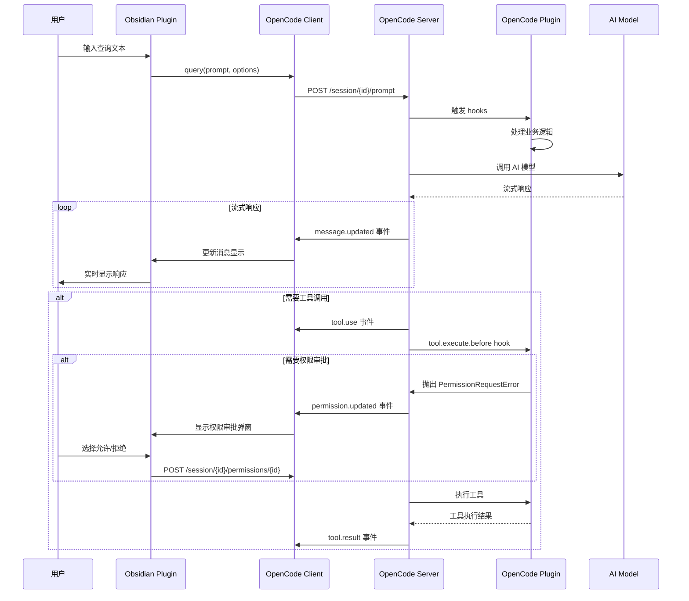
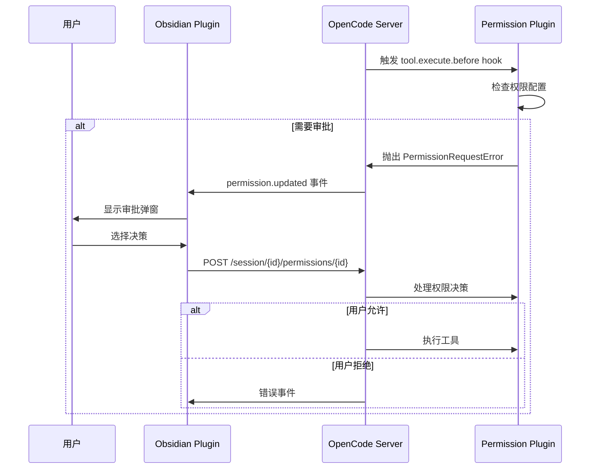
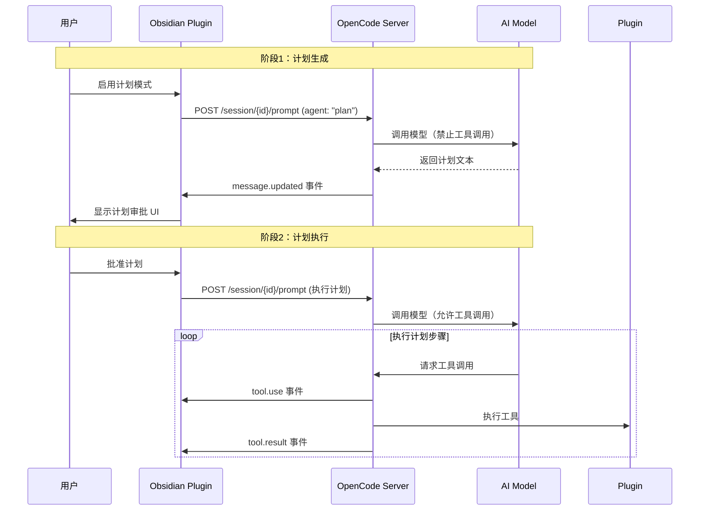

# Claudesidian OpenCode 架构设计文档

> **基于 OpenCode SDK 的 Obsidian 插件重构设计方案**

---

## 目录

1. [概述](#概述)
2. [功能映射](#功能映射)
3. [架构设计](#架构设计)
4. [Plugin 设计](#plugin-设计)
5. [数据流与交互](#数据流与交互)
6. [配置管理](#配置管理)
7. [迁移方案](#迁移方案)
8. [API 参考](#api-参考)

---

## 概述

### 项目背景

Claudesidian 是一个 Obsidian 插件，提供了在 Obsidian 中集成 Claude AI 的能力。当前实现中，Obsidian 插件包含了大量业务逻辑，包括会话管理、权限管理、工具调用等。

随着 OpenCode 的成熟，我们计划将业务逻辑迁移到 OpenCode 插件层，使 Obsidian 插件专注于 UI 渲染和用户交互。

### 设计目标

1. **职责分离**：Obsidian 插件仅负责 UI，业务逻辑下沉到 OpenCode 插件
2. **可维护性**：模块化设计，每个功能点独立实现
3. **可扩展性**：通过 OpenCode 插件系统轻松添加新功能
4. **向后兼容**：保持现有 Obsidian 插件的 UI 和用户体验
5. **性能优化**：利用 OpenCode 的流式处理能力

### 架构原则

- **薄层原则**：Obsidian 插件作为薄客户端层
- **插件化**：所有业务逻辑通过 OpenCode 插件实现
- **事件驱动**：使用 OpenCode 事件系统处理交互
- **配置驱动**：通过 `opencode.jsonc` 管理配置

---

## 功能映射

### 核心服务迁移对照表

| 现有功能 | 当前实现 | OpenCode 迁移方案 |
|---------|---------|------------------|
| **AI 查询** | `ClaudianService.query()` | `client.session.prompt()` |
| **流式响应** | `ClaudianService.queryViaSDK()` | OpenCode Event Stream |
| **会话管理** | `SessionManager` | OpenCode Session API |
| **工具调用** | `tool_use` 事件处理 | OpenCode Tool Events |
| **权限管理** | `ApprovalManager` | OpenCode Permission Plugin |
| **图像处理** | `buildPromptWithImages()` | OpenCode Image Parts API |
| **计划模式** | `planMode` 相关逻辑 | OpenCode Agent API (`agent: "plan"`) |
| **MCP 配置** | `McpService.loadServers()` | `opencode.jsonc` 中的 `mcp` 对象 |
| **斜杠命令** | `SlashCommandManager` | OpenCode Plugin (slash-commands.ts) |
| **文件操作** | `FileContextManager` | OpenCode Plugin (vault-context.ts) |

### UI 组件保留策略

| 组件 | 保留方案 |
|------|---------|
| `ClaudianView` | 完全保留，移除业务逻辑 |
| `MessageRenderer` | 完全保留，数据源改为事件流 |
| `PermissionModal` | 保留 UI，逻辑下沉到 Plugin |
| `FileContextManager` | UI 保留，扫描逻辑下沉到 Plugin |
| `ImageContextManager` | UI 保留，编码逻辑下沉到 Plugin |

---

## 架构设计

### 整体架构

```
┌─────────────────────────────────────────────────────────────┐
│                    Obsidian Plugin Layer                    │
│  (UI Only - Thin Client)                                     │
│                                                              │
│  ┌──────────────┐  ┌──────────────┐  ┌──────────────┐     │
│  │ ClaudianView │  │ Input UI     │  │ Approval UI  │     │
│  │ Renderer     │  │ Components   │  │ Modals       │     │
│  └──────┬───────┘  └──────┬───────┘  └──────┬───────┘     │
│         │                  │                  │              │
│  ┌──────┴──────────────────┴──────────────────┴───────┐     │
│  │         OpenCode Client (Communication)            │     │
│  └──────────────┬─────────────────────────────────────┘     │
└─────────────────┼──────────────────────────────────────────┘
                  │
                  │ HTTP/WebSocket + Event Stream
                  │
┌─────────────────┴──────────────────────────────────────────┐
│                  OpenCode Server Layer                     │
│  (Core Intelligence)                                        │
│                                                              │
│  ┌──────────────┐  ┌──────────────┐  ┌──────────────┐     │
│  │ Session API  │  │ Model API    │  │ Event Stream │     │
│  │ Tool API     │  │ Agent API    │  │ Permission   │     │
│  └──────┬───────┘  └──────┬───────┘  └──────┬───────┘     │
│         │                  │                  │              │
└─────────┼──────────────────┼──────────────────┼──────────────┘
          │                  │                  │
          │ Plugin Hooks     │ Tool Execution   │ Event Handling
          │                  │                  │
┌─────────┴──────────────────┴──────────────────┴──────────────┐
│              OpenCode Plugin Layer                          │
│  (Business Logic - Modular)                                 │
│                                                              │
│  ┌──────────────┐  ┌──────────────┐  ┌──────────────┐     │
│  │ Vault Plugin │  │ Permission   │  │ Plan Mode    │     │
│  │              │  │ Plugin       │  │ Plugin       │     │
│  └──────────────┘  └──────────────┘  └──────────────┘     │
│                                                              │
│  ┌──────────────┐  ┌──────────────┐  ┌──────────────┐     │
│  │ Context      │  │ Slash Command│  │ MCP Router   │     │
│  │ Plugin       │  │ Plugin       │  │ Plugin       │     │
│  └──────────────┘  └──────────────┘  └──────────────┘     │
│                                                              │
│  ┌──────────────┐  ┌──────────────┐                        │
│  │ Session      │  │ Image        │                        │
│  │ Manager      │  │ Processor    │                        │
│  │ Plugin       │  │ Plugin       │                        │
│  └──────────────┘  └──────────────┘                        │
└──────────────────────────────────────────────────────────────┘
```

### 职责划分

| 层级 | 职责 | 技术栈 | 代码量估算 |
|------|------|--------|-----------|
| **Obsidian Plugin** | UI 渲染、用户交互、本地存储 | TypeScript, Obsidian API | ~3000 行 |
| **OpenCode Client** | HTTP 通信、事件流处理、状态同步 | TypeScript, OpenCode SDK | ~500 行 |
| **OpenCode Server** | 会话管理、模型调用、工具编排 | OpenCode Core | 已实现 |
| **OpenCode Plugins** | 业务逻辑、工具扩展、事件处理 | TypeScript, Plugin API | ~2000 行 |

#### 职责边界

**Obsidian Plugin 层职责**：
- ✅ UI 组件渲染（消息列表、输入框、工具栏等）
- ✅ 用户交互处理（点击、键盘输入、拖拽等）
- ✅ 本地状态管理（UI 状态、用户偏好设置）
- ✅ 事件流订阅和显示（接收 OpenCode 事件并渲染）
- ✅ 权限审批 UI（显示审批弹窗，调用权限 API）
- ❌ 业务逻辑处理（权限判断、命令展开、文件操作等）
- ❌ 工具执行逻辑（应由 OpenCode Plugins 处理）

**OpenCode Plugin 层职责**：
- ✅ 业务逻辑处理（权限检查、命令展开、文件操作等）
- ✅ 工具定义和执行（Vault 工具、自定义工具等）
- ✅ 事件处理（session.created、permission.updated 等）
- ✅ Hook 拦截（tool.execute.before、compaction hook 等）
- ✅ 系统 prompt 构建和注入（通过 compaction hook）
- ✅ 配置管理（读取和更新 `opencode.jsonc`）
- ❌ UI 渲染（应由 Obsidian Plugin 处理）
- ❌ 用户交互处理（应由 Obsidian Plugin 处理）

#### 3.2.1 层级职责详细定义

为了确保职责边界清晰，我们定义了 `LayerResponsibilities` 接口，明确每层的允许和禁止操作：

```typescript
interface LayerResponsibilities {
  obsidianPlugin: {
    allowed: [
      'UI 组件渲染',
      '用户事件捕获',
      '事件转发到 OpenCode Client',
      'OpenCode 事件流消费与展示',
      'Obsidian API 调用代理'
    ];
    forbidden: [
      '业务逻辑处理',
      '状态计算',
      '数据转换',
      '权限判断',
      '文件内容编码',
      '路径扫描逻辑',
      '命令展开逻辑'
    ];
  };
  opencodeClient: {
    allowed: [
      '与 OpenCode Server 通信',
      '事件流管理',
      '本地 UI 状态缓存',
      '请求/响应转换'
    ];
    forbidden: [
      '业务逻辑处理',
      '工具执行',
      '权限判断'
    ];
  };
  opencodePlugin: {
    allowed: [
      '所有业务逻辑',
      '工具实现',
      '权限管理',
      '状态管理',
      '文件操作',
      '图片编码',
      '路径扫描',
      '命令展开',
      '配置管理'
    ];
    forbidden: [
      'UI 渲染',
      '用户交互处理',
      '直接访问 Obsidian API'
    ];
  };
}
```

**关键职责迁移说明**：

1. **图片上下文管理**：
   - ❌ **之前**：Obsidian 层负责图片 Base64 编码
   - ✅ **之后**：Obsidian 仅发送图片文件路径，OpenCode Plugin 层负责读取和编码
   - 详见"4.7 Image Processor Plugin"章节

2. **文件上下文管理**：
   - ❌ **之前**：Obsidian 层的 `ContextPathScanner` 执行路径扫描逻辑
   - ✅ **之后**：Obsidian 仅触发扫描请求，OpenCode Plugin 执行扫描逻辑
   - 详见"4.1 Vault Context Plugin"中的 `vault_scan_context_paths` 工具

3. **权限管理**：
   - ❌ **之前**：权限规则管理和权限持久化在 Obsidian 层
   - ✅ **之后**：权限规则管理和权限持久化完全在 OpenCode Plugin 层
   - Obsidian 层仅负责审批 UI 展示
   - 详见"4.2 Permission Manager Plugin"章节

### 通信协议

#### HTTP API

```
POST /session/create
  Body: { agent?: string, model?: ModelConfig }
  Response: { id: string }

POST /session/{id}/prompt
  Body: { system?: string, parts: Part[], model?: ModelConfig, agent?: string }
  Query: { directory?: string }
  Response: { messageId: string }

GET /session/{id}/message/{messageId}
  Response: Message

POST /session/{id}/permissions/{permissionID}
  Body: { response: "allow" | "deny", remember?: boolean }
  Response: 200 OK

GET /event 或 GET /global/event
  Query: { sessionID?: string }
  Response: EventStream (SSE)
```

#### 事件流订阅

Obsidian 插件通过 SSE 订阅事件流，接收系统事件。所有事件类型使用命名空间组织，确保类型安全。

#### 3.3.2.1 事件类型定义

事件类型使用 TypeScript 命名空间组织，支持完整的类型推断：

```typescript
namespace OpenCodeEvents {
  namespace Session {
    interface Created {
      type: 'session.created';
      properties: {
        sessionId: string;
        agent?: string;
        model?: string;
        timestamp: number;
      };
    }
    interface Resumed {
      type: 'session.resumed';
      properties: {
        sessionId: string;
        timestamp: number;
      };
    }
    interface Ended {
      type: 'session.ended';
      properties: {
        sessionId: string;
        reason: string;
        timestamp: number;
      };
    }
    interface StateChanged {
      type: 'session.state_changed';
      properties: {
        sessionId: string;
        state: any;
        timestamp: number;
      };
    }
    interface ContextUpdated {
      type: 'session.context_updated';
      properties: {
        sessionId: string;
        context: any;
        timestamp: number;
      };
    }
  }

  namespace Message {
    interface BeforeSend {
      type: 'message.before_send';
      properties: {
        sessionId: string;
        message: any;
        timestamp: number;
      };
    }
    interface Sent {
      type: 'message.sent';
      properties: {
        sessionId: string;
        messageId: string;
        timestamp: number;
      };
    }
    interface StreamStarted {
      type: 'message.stream_started';
      properties: {
        sessionId: string;
        messageId: string;
        timestamp: number;
      };
    }
    interface StreamChunk {
      type: 'message.stream_chunk';
      properties: {
        sessionId: string;
        messageId: string;
        chunk: string;
        timestamp: number;
      };
    }
    interface StreamEnded {
      type: 'message.stream_ended';
      properties: {
        sessionId: string;
        messageId: string;
        timestamp: number;
      };
    }
    interface Updated {
      type: 'message.updated';
      properties: {
        sessionId: string;
        messageId: string;
        info: Message;
        timestamp: number;
      };
    }
    interface Error {
      type: 'message.error';
      properties: {
        sessionId: string;
        messageId?: string;
        error: string;
        timestamp: number;
      };
    }
  }

  namespace Tool {
    interface BeforeUse {
      type: 'tool.before_use';
      properties: {
        sessionId: string;
        tool: string;
        input: any;
        timestamp: number;
      };
    }
    interface Use {
      type: 'tool.use';
      properties: {
        sessionId: string;
        tool: string;
        input: any;
        toolCallId: string;
        timestamp: number;
      };
    }
    interface Progress {
      type: 'tool.progress';
      properties: {
        sessionId: string;
        toolCallId: string;
        progress: any;
        timestamp: number;
      };
    }
    interface Result {
      type: 'tool.result';
      properties: {
        sessionId: string;
        toolCallId: string;
        result: StandardToolResult;
        timestamp: number;
      };
    }
    interface Error {
      type: 'tool.error';
      properties: {
        sessionId: string;
        toolCallId: string;
        error: string;
        timestamp: number;
      };
    }
  }

  namespace Permission {
    interface Requested {
      type: 'permission.requested';
      properties: {
        sessionId: string;
        permissionID: string;
        tool: string;
        input: any;
        timestamp: number;
      };
    }
    interface Granted {
      type: 'permission.granted';
      properties: {
        sessionId: string;
        permissionID: string;
        timestamp: number;
      };
    }
    interface Denied {
      type: 'permission.denied';
      properties: {
        sessionId: string;
        permissionID: string;
        timestamp: number;
      };
    }
    interface RuleChanged {
      type: 'permission.rule_changed';
      properties: {
        sessionId?: string;
        rule: any;
        timestamp: number;
      };
    }
    // 兼容旧版本
    interface Updated {
      type: 'permission.updated';
      properties: {
        sessionId: string;
        permissionID: string;
        tool: string;
        input: any;
        requiresApproval: boolean;
        timestamp: number;
      };
    }
  }

  namespace Plan {
    interface Created {
      type: 'plan.created';
      properties: {
        sessionId: string;
        planId: string;
        plan: any;
        timestamp: number;
      };
    }
    interface StepStarted {
      type: 'plan.step_started';
      properties: {
        sessionId: string;
        planId: string;
        stepId: string;
        timestamp: number;
      };
    }
    interface StepCompleted {
      type: 'plan.step_completed';
      properties: {
        sessionId: string;
        planId: string;
        stepId: string;
        result: any;
        timestamp: number;
      };
    }
    interface StepFailed {
      type: 'plan.step_failed';
      properties: {
        sessionId: string;
        planId: string;
        stepId: string;
        error: string;
        timestamp: number;
      };
    }
    interface Completed {
      type: 'plan.completed';
      properties: {
        sessionId: string;
        planId: string;
        timestamp: number;
      };
    }
    interface Cancelled {
      type: 'plan.cancelled';
      properties: {
        sessionId: string;
        planId: string;
        timestamp: number;
      };
    }
  }

  namespace MCP {
    interface ServerStarting {
      type: 'mcp.server_starting';
      properties: {
        serverName: string;
        timestamp: number;
      };
    }
    interface ServerStarted {
      type: 'mcp.server_started';
      properties: {
        serverName: string;
        timestamp: number;
      };
    }
    interface ServerStopped {
      type: 'mcp.server_stopped';
      properties: {
        serverName: string;
        timestamp: number;
      };
    }
    interface ServerError {
      type: 'mcp.server_error';
      properties: {
        serverName: string;
        error: string;
        timestamp: number;
      };
    }
    interface ToolCalled {
      type: 'mcp.tool_called';
      properties: {
        serverName: string;
        tool: string;
        input: any;
        timestamp: number;
      };
    }
    interface ToolResult {
      type: 'mcp.tool_result';
      properties: {
        serverName: string;
        tool: string;
        result: any;
        timestamp: number;
      };
    }
  }

  namespace Error {
    interface Occurred {
      type: 'error.occurred';
      properties: {
        sessionId?: string;
        error: any;
        timestamp: number;
      };
    }
    interface Recovered {
      type: 'error.recovered';
      properties: {
        sessionId?: string;
        error: any;
        timestamp: number;
      };
    }
  }

  namespace Connection {
    interface Connecting {
      type: 'connection.connecting';
      properties: {
        timestamp: number;
      };
    }
    interface Connected {
      type: 'connection.connected';
      properties: {
        timestamp: number;
      };
    }
    interface Disconnected {
      type: 'connection.disconnected';
      properties: {
        reason?: string;
        timestamp: number;
      };
    }
    interface Reconnecting {
      type: 'connection.reconnecting';
      properties: {
        attempt: number;
        timestamp: number;
      };
    }
  }

  namespace Image {
    interface ProcessingStarted {
      type: 'image.processing_started';
      properties: {
        sessionId: string;
        imagePath: string;
        timestamp: number;
      };
    }
    interface ProcessingProgress {
      type: 'image.processing_progress';
      properties: {
        sessionId: string;
        imagePath: string;
        progress: number;  // 0-100
        timestamp: number;
      };
    }
    interface ProcessingCompleted {
      type: 'image.processing_completed';
      properties: {
        sessionId: string;
        imagePath: string;
        result: any;
        timestamp: number;
      };
    }
  }
}

// 类型安全的事件处理器
class TypedEventEmitter {
  private listeners: Map<string, Set<Function>> = new Map();

  on<T extends keyof OpenCodeEvents.Session>(
    event: T,
    handler: (event: OpenCodeEvents.Session[T]) => void
  ): void;
  on<T extends keyof OpenCodeEvents.Message>(
    event: T,
    handler: (event: OpenCodeEvents.Message[T]) => void
  ): void;
  on<T extends keyof OpenCodeEvents.Tool>(
    event: T,
    handler: (event: OpenCodeEvents.Tool[T]) => void
  ): void;
  on<T extends keyof OpenCodeEvents.Permission>(
    event: T,
    handler: (event: OpenCodeEvents.Permission[T]) => void
  ): void;
  on<T extends keyof OpenCodeEvents.Plan>(
    event: T,
    handler: (event: OpenCodeEvents.Plan[T]) => void
  ): void;
  on<T extends keyof OpenCodeEvents.MCP>(
    event: T,
    handler: (event: OpenCodeEvents.MCP[T]) => void
  ): void;
  on<T extends keyof OpenCodeEvents.Error>(
    event: T,
    handler: (event: OpenCodeEvents.Error[T]) => void
  ): void;
  on<T extends keyof OpenCodeEvents.Connection>(
    event: T,
    handler: (event: OpenCodeEvents.Connection[T]) => void
  ): void;
  on<T extends keyof OpenCodeEvents.Image>(
    event: T,
    handler: (event: OpenCodeEvents.Image[T]) => void
  ): void;
  // 实现省略...

  emit<T>(event: T, data: any): void {
    // 实现事件发射逻辑
  }
}
```

### 3.3 状态管理设计

#### 3.3.1 状态分类体系

系统状态按所有权和同步需求分为以下类别：

```typescript
enum StateCategory {
  ServerAuthoritative = 'server_authoritative',  // 服务器拥有最终决定权
  ClientLocal = 'client_local',                  // 客户端本地状态
  Bidirectional = 'bidirectional',               // 双向同步
  Derived = 'derived'                            // 派生状态（由其他状态计算得出）
}
```

#### 3.3.2 状态注册表

所有系统状态必须在 `STATE_REGISTRY` 中注册，定义同步策略和冲突解决机制：

```typescript
interface StateRegistryEntry {
  key: string;
  category: StateCategory;
  syncStrategy: {
    method: 'pull' | 'push' | 'push_pull';
    trigger: 'event' | 'interval' | 'manual';
    interval?: number;  // 毫秒，仅当 trigger === 'interval' 时使用
  };
  conflictResolution: 'server_wins' | 'client_wins' | 'last_write_wins' | 'merge';
  persistence?: {
    location: 'memory' | 'localStorage' | 'indexedDB' | 'file';
    encryption?: boolean;
    ttl?: number;  // 毫秒，状态过期时间
    maxEntries?: number;  // 最大条目数（用于列表类型状态）
  };
}

const STATE_REGISTRY: Record<string, StateRegistryEntry> = {
  'session.id': {
    key: 'session.id',
    category: StateCategory.ServerAuthoritative,
    syncStrategy: { method: 'pull', trigger: 'event' },
    conflictResolution: 'server_wins'
  },
  'session.state': {
    key: 'session.state',
    category: StateCategory.ServerAuthoritative,
    syncStrategy: { method: 'pull', trigger: 'event' },
    conflictResolution: 'server_wins',
    persistence: { location: 'memory' }
  },
  'plan.current': {
    key: 'plan.current',
    category: StateCategory.Bidirectional,
    syncStrategy: { method: 'push_pull', trigger: 'event' },
    conflictResolution: 'last_write_wins',
    persistence: { location: 'localStorage', ttl: 86400000 }  // 24小时
  },
  'plan.steps': {
    key: 'plan.steps',
    category: StateCategory.Bidirectional,
    syncStrategy: { method: 'push_pull', trigger: 'event' },
    conflictResolution: 'merge',
    persistence: { location: 'localStorage', ttl: 86400000 }
  },
  'client.ui.preferences': {
    key: 'client.ui.preferences',
    category: StateCategory.ClientLocal,
    syncStrategy: { method: 'push', trigger: 'manual' },
    conflictResolution: 'client_wins',
    persistence: { location: 'localStorage' }
  },
  'context.files': {
    key: 'context.files',
    category: StateCategory.Derived,
    syncStrategy: { method: 'pull', trigger: 'event' },
    conflictResolution: 'server_wins',
    persistence: { location: 'memory', ttl: 300000 }  // 5分钟
  }
  // ... 更多状态定义
};
```

#### 3.3.3 状态同步管理器

`StateSyncManager` 负责管理所有状态的同步、冲突解决和持久化：

```typescript
class StateSyncManager {
  private registry: Map<string, StateRegistryEntry>;
  private stateCache: Map<string, any>;
  private syncTimers: Map<string, NodeJS.Timeout>;

  /**
   * 获取状态值
   */
  async getState<T>(key: string): Promise<T | null> {
    // 1. 检查缓存
    if (this.stateCache.has(key)) {
      return this.stateCache.get(key) as T;
    }

    // 2. 检查持久化存储
    const entry = this.registry.get(key);
    if (entry?.persistence) {
      const persisted = await this.loadFromPersistence(key, entry.persistence);
      if (persisted !== null) {
        this.stateCache.set(key, persisted);
        return persisted as T;
      }
    }

    // 3. 从服务器拉取（如果是 ServerAuthoritative 或 Bidirectional）
    if (entry?.category === StateCategory.ServerAuthoritative || 
        entry?.category === StateCategory.Bidirectional) {
      const serverValue = await this.pullFromServer(key);
      if (serverValue !== null) {
        this.stateCache.set(key, serverValue);
        await this.saveToPersistence(key, serverValue, entry?.persistence);
        return serverValue as T;
      }
    }

    return null;
  }

  /**
   * 设置状态值
   */
  async setState<T>(key: string, value: T): Promise<void> {
    const entry = this.registry.get(key);
    if (!entry) {
      throw new Error(`State key "${key}" not found in registry`);
    }

    // 1. 更新本地缓存
    this.stateCache.set(key, value);

    // 2. 保存到持久化存储
    if (entry.persistence) {
      await this.saveToPersistence(key, value, entry.persistence);
    }

    // 3. 推送到服务器（如果是 push 或 push_pull）
    if (entry.syncStrategy.method === 'push' || 
        entry.syncStrategy.method === 'push_pull') {
      await this.pushToServer(key, value);
    }

    // 4. 触发同步事件
    this.emitStateChange(key, value);
  }

  /**
   * 处理服务器状态更新
   */
  async handleServerStateUpdate(key: string, serverValue: any): Promise<void> {
    const entry = this.registry.get(key);
    if (!entry) {
      return;
    }

    const localValue = this.stateCache.get(key);

    // 检查是否需要冲突解决
    if (localValue !== undefined && localValue !== serverValue) {
      const resolved = await this.resolveConflict(key, serverValue, localValue, entry);
      this.stateCache.set(key, resolved);
      await this.saveToPersistence(key, resolved, entry?.persistence);
      this.emitStateChange(key, resolved);
    } else {
      // 无冲突，直接更新
      this.stateCache.set(key, serverValue);
      await this.saveToPersistence(key, serverValue, entry?.persistence);
      this.emitStateChange(key, serverValue);
    }
  }

  /**
   * 解决状态冲突
   */
  async resolveConflict(
    key: string,
    serverValue: any,
    clientValue: any,
    entry: StateRegistryEntry
  ): Promise<any> {
    switch (entry.conflictResolution) {
      case 'server_wins':
        return serverValue;
      case 'client_wins':
        return clientValue;
      case 'last_write_wins':
        // 比较时间戳（假设值包含 timestamp 字段）
        const serverTime = serverValue?.timestamp || 0;
        const clientTime = clientValue?.timestamp || 0;
        return serverTime > clientTime ? serverValue : clientValue;
      case 'merge':
        // 合并策略（根据状态类型实现）
        return this.mergeValues(serverValue, clientValue);
      default:
        return serverValue;
    }
  }

  /**
   * 启动定时同步
   */
  startPeriodicSync(): void {
    for (const [key, entry] of this.registry.entries()) {
      if (entry.syncStrategy.trigger === 'interval' && entry.syncStrategy.interval) {
        const timer = setInterval(() => {
          this.syncState(key);
        }, entry.syncStrategy.interval);
        this.syncTimers.set(key, timer);
      }
    }
  }

  /**
   * 停止定时同步
   */
  stopPeriodicSync(): void {
    for (const timer of this.syncTimers.values()) {
      clearInterval(timer);
    }
    this.syncTimers.clear();
  }

  private async syncState(key: string): Promise<void> {
    const entry = this.registry.get(key);
    if (!entry) {
      return;
    }

    if (entry.syncStrategy.method === 'pull' || 
        entry.syncStrategy.method === 'push_pull') {
      const serverValue = await this.pullFromServer(key);
      if (serverValue !== null) {
        await this.handleServerStateUpdate(key, serverValue);
      }
    }
  }

  private mergeValues(serverValue: any, clientValue: any): any {
    // 简单的合并策略：如果是对象，合并属性；如果是数组，合并去重
    if (Array.isArray(serverValue) && Array.isArray(clientValue)) {
      return [...new Set([...serverValue, ...clientValue])];
    }
    if (typeof serverValue === 'object' && typeof clientValue === 'object') {
      return { ...serverValue, ...clientValue };
    }
    return serverValue;
  }

  private emitStateChange(key: string, value: any): void {
    // 触发状态变更事件，通知监听者
    // 实现事件发射逻辑
  }

  private async pullFromServer(key: string): Promise<any> {
    // 从服务器拉取状态
    // 实现 HTTP 请求逻辑
  }

  private async pushToServer(key: string, value: any): Promise<void> {
    // 推送状态到服务器
    // 实现 HTTP 请求逻辑
  }

  private async loadFromPersistence(
    key: string,
    persistence: StateRegistryEntry['persistence']
  ): Promise<any> {
    // 从持久化存储加载
    // 实现存储读取逻辑
  }

  private async saveToPersistence(
    key: string,
    value: any,
    persistence: StateRegistryEntry['persistence']
  ): Promise<void> {
    // 保存到持久化存储
    // 实现存储写入逻辑
  }
}
```

#### 3.3.4 状态持久化策略

状态持久化支持多种存储后端：

- **memory**：仅内存缓存，进程重启后丢失
- **localStorage**：浏览器本地存储，适合小量数据（< 5MB）
- **indexedDB**：浏览器数据库，适合大量结构化数据
- **file**：文件系统存储，适合服务端或 Node.js 环境

持久化配置支持加密和 TTL（Time To Live）机制，确保敏感数据安全和过期数据清理。

#### 3.3.5 状态所有权定义

每个状态都有明确的所有者，定义谁可以修改状态以及如何访问状态：

```typescript
type StateOwner = 'obsidian' | 'opencode_client' | 'opencode_server' | 'opencode_plugin';

interface StateOwnership {
  owner: StateOwner;
  readers: StateOwner[];  // 可读取状态的实体列表
  mutationMethod: 'direct' | 'request' | 'event';  // 修改方式
  notificationMethod: 'push' | 'pull' | 'none';  // 通知方式
}

const STATE_OWNERSHIP: Record<string, StateOwnership> = {
  'session.*': {
    owner: 'opencode_server',
    readers: ['obsidian', 'opencode_client', 'opencode_plugin'],
    mutationMethod: 'direct',
    notificationMethod: 'push'
  },
  'session.id': {
    owner: 'opencode_server',
    readers: ['obsidian', 'opencode_client'],
    mutationMethod: 'direct',
    notificationMethod: 'push'
  },
  'session.state': {
    owner: 'opencode_server',
    readers: ['obsidian', 'opencode_client', 'opencode_plugin'],
    mutationMethod: 'direct',
    notificationMethod: 'push'
  },
  'plan.*': {
    owner: 'opencode_plugin',
    readers: ['obsidian', 'opencode_client', 'opencode_server'],
    mutationMethod: 'request',
    notificationMethod: 'push'
  },
  'plan.current': {
    owner: 'opencode_plugin',
    readers: ['obsidian', 'opencode_client'],
    mutationMethod: 'request',
    notificationMethod: 'push'
  },
  'plan.steps': {
    owner: 'opencode_plugin',
    readers: ['obsidian', 'opencode_client'],
    mutationMethod: 'request',
    notificationMethod: 'push'
  },
  'context.*': {
    owner: 'obsidian',
    readers: ['opencode_plugin', 'opencode_server'],
    mutationMethod: 'event',
    notificationMethod: 'pull'
  },
  'context.files': {
    owner: 'obsidian',
    readers: ['opencode_plugin'],
    mutationMethod: 'event',
    notificationMethod: 'pull'
  },
  'client.*': {
    owner: 'opencode_client',
    readers: ['obsidian'],
    mutationMethod: 'direct',
    notificationMethod: 'none'
  },
  'client.ui.preferences': {
    owner: 'opencode_client',
    readers: ['obsidian'],
    mutationMethod: 'direct',
    notificationMethod: 'none'
  }
};
```

**所有权规则说明**：

- **direct**：所有者可以直接修改状态，无需请求
- **request**：非所有者需要通过请求协议修改状态
- **event**：通过事件机制修改状态
- **push**：状态变更时主动推送通知
- **pull**：需要主动拉取状态变更
- **none**：不通知其他实体

#### 3.3.6 状态守卫

`StateGuard` 类负责强制执行状态所有权规则：

```typescript
class StateGuard {
  private ownership: Map<string, StateOwnership>;

  /**
   * 检查实体是否可以修改状态
   */
  canMutate(owner: StateOwner, key: string): boolean {
    const ownership = this.ownership.get(key);
    if (!ownership) {
      return false;  // 未定义所有权的状态不允许修改
    }
    return ownership.owner === owner;
  }

  /**
   * 检查实体是否可以读取状态
   */
  canRead(reader: StateOwner, key: string): boolean {
    const ownership = this.ownership.get(key);
    if (!ownership) {
      return false;
    }
    return ownership.readers.includes(reader) || ownership.owner === reader;
  }

  /**
   * 修改状态（强制执行所有权）
   */
  async mutate<T>(
    owner: StateOwner,
    key: string,
    value: T
  ): Promise<void> {
    if (!this.canMutate(owner, key)) {
      throw new Error(
        `Entity "${owner}" is not allowed to mutate state "${key}". ` +
        `Owner is "${this.ownership.get(key)?.owner}"`
      );
    }

    const ownership = this.ownership.get(key)!;
    
    // 根据 mutationMethod 执行不同的修改策略
    switch (ownership.mutationMethod) {
      case 'direct':
        await this.directMutate(key, value);
        break;
      case 'request':
        await this.requestMutate(owner, key, value);
        break;
      case 'event':
        await this.eventMutate(owner, key, value);
        break;
    }

    // 根据 notificationMethod 通知其他实体
    if (ownership.notificationMethod === 'push') {
      await this.notifyReaders(key, value, ownership.readers);
    }
  }

  /**
   * 请求修改状态（非所有者使用）
   */
  async requestMutation<T>(
    requester: StateOwner,
    key: string,
    value: T
  ): Promise<T> {
    const ownership = this.ownership.get(key);
    if (!ownership) {
      throw new Error(`State "${key}" not found`);
    }

    if (ownership.owner === requester) {
      // 如果是所有者，直接修改
      await this.mutate(requester, key, value);
      return value;
    }

    // 非所有者需要发送请求
    const request: StateMutationRequest = {
      key,
      value,
      requester,
      timestamp: Date.now()
    };

    const response = await this.sendMutationRequest(request, ownership.owner);
    
    if (!response.success) {
      throw new Error(response.error || 'Mutation request failed');
    }

    return response.value as T;
  }

  private async directMutate<T>(key: string, value: T): Promise<void> {
    // 直接修改状态
    // 实现状态更新逻辑
  }

  private async requestMutate<T>(
    requester: StateOwner,
    key: string,
    value: T
  ): Promise<void> {
    // 通过请求协议修改状态
    // 实现请求发送逻辑
  }

  private async eventMutate<T>(
    requester: StateOwner,
    key: string,
    value: T
  ): Promise<void> {
    // 通过事件机制修改状态
    // 实现事件发送逻辑
  }

  private async notifyReaders(
    key: string,
    value: any,
    readers: StateOwner[]
  ): Promise<void> {
    // 通知所有读者状态已变更
    // 实现通知逻辑
  }

  private async sendMutationRequest(
    request: StateMutationRequest,
    owner: StateOwner
  ): Promise<StateMutationResponse> {
    // 发送状态修改请求到所有者
    // 实现请求发送逻辑
    return { success: true, value: request.value };
  }
}
```

#### 3.3.7 跨实体状态请求协议

非所有者修改状态需要通过请求协议：

```typescript
interface StateMutationRequest {
  key: string;
  value: any;
  requester: StateOwner;
  timestamp: number;
  reason?: string;  // 可选：修改原因
}

interface StateMutationResponse {
  success: boolean;
  value?: any;
  error?: string;
  timestamp?: number;
}
```

**请求流程**：

1. 非所有者调用 `StateGuard.requestMutation()` 发送请求
2. 请求发送到状态所有者（通过 HTTP API 或事件系统）
3. 所有者验证请求并决定是否允许修改
4. 所有者返回 `StateMutationResponse`
5. 如果成功，状态更新并通知所有读者

---

### 3.4 错误处理设计

#### 3.4.1 错误分类体系

系统错误按类别、严重程度和可恢复性进行分类：

```typescript
enum ErrorCategory {
  Network = 'network',              // 网络错误（连接失败、超时等）
  Authentication = 'authentication', // 认证错误（token 过期、权限不足等）
  Validation = 'validation',        // 验证错误（参数无效、格式错误等）
  Resource = 'resource',           // 资源错误（文件不存在、内存不足等）
  Tool = 'tool',                    // 工具执行错误
  Permission = 'permission',        // 权限错误
  Server = 'server',                // 服务器内部错误
  ExternalService = 'external_service', // 外部服务错误（API 调用失败等）
  Unknown = 'unknown'               // 未知错误
}

enum ErrorSeverity {
  Ignorable = 'ignorable',  // 可忽略的错误（不影响功能）
  Warning = 'warning',      // 警告（可能影响功能）
  Error = 'error',          // 错误（影响功能）
  Fatal = 'fatal'           // 致命错误（系统无法继续运行）
}

enum ErrorRecoverability {
  AutoRecoverable = 'auto_recoverable',    // 可自动恢复
  UserRecoverable = 'user_recoverable',    // 需要用户干预
  Unrecoverable = 'unrecoverable'          // 不可恢复
}
```

#### 3.4.2 结构化错误接口

所有错误都使用 `StructuredError` 接口，提供完整的错误信息：

```typescript
interface StructuredError {
  id: string;                    // 错误唯一标识
  code: string;                  // 错误代码（如 'NETWORK_TIMEOUT'）
  category: ErrorCategory;
  severity: ErrorSeverity;
  recoverability: ErrorRecoverability;
  message: string;               // 用户友好的错误消息
  details?: any;                 // 详细错误信息
  cause?: Error;                 // 原始错误对象
  suggestedActions?: string[];   // 建议的修复操作
  timestamp: number;             // 错误发生时间
  context?: {                    // 错误上下文
    sessionId?: string;
    userId?: string;
    tool?: string;
    [key: string]: any;
  };
}
```

#### 3.4.3 重试策略

定义 `RetryPolicy` 接口，支持多种退避策略：

```typescript
type BackoffStrategy = 'fixed' | 'linear' | 'exponential';

interface RetryPolicy {
  maxAttempts: number;           // 最大重试次数
  backoff: {
    strategy: BackoffStrategy;
    initialDelay: number;        // 初始延迟（毫秒）
    maxDelay?: number;           // 最大延迟（毫秒）
    multiplier?: number;         // 退避乘数（仅用于 exponential）
  };
  retryableCategories: ErrorCategory[];  // 可重试的错误类别
  retryableCodes: string[];     // 可重试的错误代码
  onRetry?: (error: StructuredError, attempt: number) => void;  // 重试回调
}
```

**退避策略示例**：

- **fixed**：固定延迟，每次重试等待相同时间
- **linear**：线性增长，延迟 = initialDelay * attempt
- **exponential**：指数增长，延迟 = initialDelay * (multiplier ^ attempt)

#### 3.4.4 降级策略

定义 `FallbackPolicy` 接口，支持多种降级机制：

```typescript
type FallbackMethod = 'cache' | 'default' | 'alternative' | 'skip' | 'custom';

interface FallbackPolicy {
  enabled: boolean;
  fallbackMethod: FallbackMethod;
  cacheKey?: string;             // 缓存键（仅用于 'cache'）
  defaultValue?: any;            // 默认值（仅用于 'default'）
  alternativeAction?: () => Promise<any>;  // 替代操作（仅用于 'alternative'）
  customHandler?: (error: StructuredError) => Promise<any>;  // 自定义处理器
  conditions?: {                 // 降级条件
    errorCategories?: ErrorCategory[];
    errorCodes?: string[];
    maxRetries?: number;
  };
}
```

#### 3.4.5 默认错误处理配置

为每个错误类别定义默认处理配置：

```typescript
const DEFAULT_ERROR_CONFIGS: Record<ErrorCategory, {
  retryPolicy: RetryPolicy;
  fallbackPolicy: FallbackPolicy;
}> = {
  [ErrorCategory.Network]: {
    retryPolicy: {
      maxAttempts: 3,
      backoff: {
        strategy: 'exponential',
        initialDelay: 1000,
        maxDelay: 10000,
        multiplier: 2
      },
      retryableCategories: [ErrorCategory.Network],
      retryableCodes: ['NETWORK_TIMEOUT', 'NETWORK_ERROR', 'CONNECTION_REFUSED']
    },
    fallbackPolicy: {
      enabled: true,
      fallbackMethod: 'cache',
      conditions: {
        errorCategories: [ErrorCategory.Network],
        maxRetries: 3
      }
    }
  },
  [ErrorCategory.Authentication]: {
    retryPolicy: {
      maxAttempts: 1,
      backoff: {
        strategy: 'fixed',
        initialDelay: 0
      },
      retryableCategories: [],
      retryableCodes: []
    },
    fallbackPolicy: {
      enabled: false,
      fallbackMethod: 'skip'
    }
  },
  [ErrorCategory.Validation]: {
    retryPolicy: {
      maxAttempts: 0,
      backoff: {
        strategy: 'fixed',
        initialDelay: 0
      },
      retryableCategories: [],
      retryableCodes: []
    },
    fallbackPolicy: {
      enabled: false,
      fallbackMethod: 'skip'
    }
  },
  [ErrorCategory.Resource]: {
    retryPolicy: {
      maxAttempts: 2,
      backoff: {
        strategy: 'linear',
        initialDelay: 500,
        maxDelay: 2000
      },
      retryableCategories: [ErrorCategory.Resource],
      retryableCodes: ['RESOURCE_BUSY', 'RESOURCE_LOCKED']
    },
    fallbackPolicy: {
      enabled: true,
      fallbackMethod: 'default',
      defaultValue: null
    }
  },
  [ErrorCategory.Tool]: {
    retryPolicy: {
      maxAttempts: 1,
      backoff: {
        strategy: 'fixed',
        initialDelay: 1000
      },
      retryableCategories: [ErrorCategory.Tool],
      retryableCodes: ['TOOL_TIMEOUT', 'TOOL_TEMPORARY_ERROR']
    },
    fallbackPolicy: {
      enabled: true,
      fallbackMethod: 'alternative',
      conditions: {
        errorCategories: [ErrorCategory.Tool]
      }
    }
  },
  [ErrorCategory.Permission]: {
    retryPolicy: {
      maxAttempts: 0,
      backoff: {
        strategy: 'fixed',
        initialDelay: 0
      },
      retryableCategories: [],
      retryableCodes: []
    },
    fallbackPolicy: {
      enabled: false,
      fallbackMethod: 'skip'
    }
  },
  [ErrorCategory.Server]: {
    retryPolicy: {
      maxAttempts: 2,
      backoff: {
        strategy: 'exponential',
        initialDelay: 2000,
        maxDelay: 10000,
        multiplier: 2
      },
      retryableCategories: [ErrorCategory.Server],
      retryableCodes: ['SERVER_ERROR', 'SERVER_OVERLOAD']
    },
    fallbackPolicy: {
      enabled: true,
      fallbackMethod: 'cache',
      conditions: {
        errorCategories: [ErrorCategory.Server]
      }
    }
  },
  [ErrorCategory.ExternalService]: {
    retryPolicy: {
      maxAttempts: 3,
      backoff: {
        strategy: 'exponential',
        initialDelay: 1000,
        maxDelay: 8000,
        multiplier: 2
      },
      retryableCategories: [ErrorCategory.ExternalService],
      retryableCodes: ['EXTERNAL_API_ERROR', 'EXTERNAL_SERVICE_UNAVAILABLE']
    },
    fallbackPolicy: {
      enabled: true,
      fallbackMethod: 'cache',
      conditions: {
        errorCategories: [ErrorCategory.ExternalService]
      }
    }
  },
  [ErrorCategory.Unknown]: {
    retryPolicy: {
      maxAttempts: 1,
      backoff: {
        strategy: 'fixed',
        initialDelay: 1000
      },
      retryableCategories: [],
      retryableCodes: []
    },
    fallbackPolicy: {
      enabled: false,
      fallbackMethod: 'skip'
    }
  }
};
```

#### 3.4.6 错误处理器

`ErrorHandler` 类负责统一处理所有错误：

```typescript
class ErrorHandler {
  private configs: Map<ErrorCategory, { retryPolicy: RetryPolicy; fallbackPolicy: FallbackPolicy }>;
  private errorCache: Map<string, StructuredError>;

  constructor() {
    // 初始化默认配置
    this.configs = new Map(
      Object.entries(DEFAULT_ERROR_CONFIGS) as [ErrorCategory, any][]
    );
    this.errorCache = new Map();
  }

  /**
   * 包装异步操作，自动处理错误
   */
  async withErrorHandling<T>(
    operation: () => Promise<T>,
    context?: { sessionId?: string; tool?: string }
  ): Promise<T> {
    try {
      return await operation();
    } catch (error) {
      const structuredError = this.normalizeError(error, context);
      return this.handleError(structuredError, operation, context) as Promise<T>;
    }
  }

  /**
   * 规范化错误为 StructuredError
   */
  normalizeError(error: any, context?: any): StructuredError {
    const category = this.categorizeError(error);
    const severity = this.determineSeverity(error, category);
    const recoverability = this.determineRecoverability(error, category);

    return {
      id: this.generateErrorId(),
      code: this.extractErrorCode(error),
      category,
      severity,
      recoverability,
      message: this.extractErrorMessage(error),
      details: error,
      cause: error instanceof Error ? error : undefined,
      suggestedActions: this.suggestActions(error, category),
      timestamp: Date.now(),
      context
    };
  }

  /**
   * 处理错误（重试和降级）
   */
  private async handleError<T>(
    error: StructuredError,
    operation: () => Promise<T>,
    context?: any
  ): Promise<T> {
    const config = this.configs.get(error.category);
    if (!config) {
      throw error;
    }

    // 尝试重试
    if (this.shouldRetry(error, config.retryPolicy)) {
      const result = await this.retry(operation, error, config.retryPolicy, context);
      if (result !== null) {
        return result;
      }
    }

    // 执行降级策略
    if (config.fallbackPolicy.enabled && this.shouldFallback(error, config.fallbackPolicy)) {
      const fallbackResult = await this.executeFallback(error, config.fallbackPolicy);
      if (fallbackResult !== null) {
        return fallbackResult as T;
      }
    }

    // 无法恢复，抛出错误
    throw error;
  }

  /**
   * 判断是否应该重试
   */
  shouldRetry(error: StructuredError, policy: RetryPolicy): boolean {
    if (policy.maxAttempts === 0) {
      return false;
    }

    const isRetryableCategory = policy.retryableCategories.includes(error.category);
    const isRetryableCode = policy.retryableCodes.includes(error.code);

    return isRetryableCategory || isRetryableCode;
  }

  /**
   * 计算重试延迟
   */
  calculateDelay(attempt: number, policy: RetryPolicy): number {
    const { backoff } = policy;
    let delay = backoff.initialDelay;

    switch (backoff.strategy) {
      case 'fixed':
        delay = backoff.initialDelay;
        break;
      case 'linear':
        delay = backoff.initialDelay * attempt;
        break;
      case 'exponential':
        delay = backoff.initialDelay * Math.pow(backoff.multiplier || 2, attempt - 1);
        break;
    }

    if (backoff.maxDelay && delay > backoff.maxDelay) {
      delay = backoff.maxDelay;
    }

    return delay;
  }

  /**
   * 执行重试
   */
  private async retry<T>(
    operation: () => Promise<T>,
    error: StructuredError,
    policy: RetryPolicy,
    context?: any
  ): Promise<T | null> {
    for (let attempt = 1; attempt <= policy.maxAttempts; attempt++) {
      const delay = this.calculateDelay(attempt, policy);
      await this.sleep(delay);

      if (policy.onRetry) {
        policy.onRetry(error, attempt);
      }

      try {
        return await operation();
      } catch (retryError) {
        if (attempt === policy.maxAttempts) {
          // 最后一次重试失败
          return null;
        }
        // 继续重试
      }
    }

    return null;
  }

  /**
   * 执行降级策略
   */
  async executeFallback(
    error: StructuredError,
    policy: FallbackPolicy
  ): Promise<any> {
    switch (policy.fallbackMethod) {
      case 'cache':
        if (policy.cacheKey) {
          return this.getFromCache(policy.cacheKey);
        }
        return null;

      case 'default':
        return policy.defaultValue;

      case 'alternative':
        if (policy.alternativeAction) {
          return await policy.alternativeAction();
        }
        return null;

      case 'skip':
        return null;

      case 'custom':
        if (policy.customHandler) {
          return await policy.customHandler(error);
        }
        return null;

      default:
        return null;
    }
  }

  private shouldFallback(error: StructuredError, policy: FallbackPolicy): boolean {
    if (!policy.conditions) {
      return true;
    }

    if (policy.conditions.errorCategories) {
      if (!policy.conditions.errorCategories.includes(error.category)) {
        return false;
      }
    }

    if (policy.conditions.errorCodes) {
      if (!policy.conditions.errorCodes.includes(error.code)) {
        return false;
      }
    }

    return true;
  }

  private categorizeError(error: any): ErrorCategory {
    // 根据错误类型和消息分类
    if (error.code?.startsWith('NETWORK_') || error.message?.includes('network')) {
      return ErrorCategory.Network;
    }
    if (error.code?.startsWith('AUTH_') || error.status === 401) {
      return ErrorCategory.Authentication;
    }
    if (error.code?.startsWith('VALIDATION_') || error.status === 400) {
      return ErrorCategory.Validation;
    }
    if (error.code?.startsWith('TOOL_')) {
      return ErrorCategory.Tool;
    }
    if (error.code?.startsWith('PERMISSION_') || error.status === 403) {
      return ErrorCategory.Permission;
    }
    if (error.status >= 500) {
      return ErrorCategory.Server;
    }
    return ErrorCategory.Unknown;
  }

  private determineSeverity(error: any, category: ErrorCategory): ErrorSeverity {
    // 根据错误类别和上下文确定严重程度
    if (category === ErrorCategory.Network && error.code === 'NETWORK_TIMEOUT') {
      return ErrorSeverity.Warning;
    }
    if (category === ErrorCategory.Validation) {
      return ErrorSeverity.Warning;
    }
    if (category === ErrorCategory.Permission) {
      return ErrorSeverity.Error;
    }
    if (category === ErrorCategory.Server) {
      return ErrorSeverity.Fatal;
    }
    return ErrorSeverity.Error;
  }

  private determineRecoverability(error: any, category: ErrorCategory): ErrorRecoverability {
    // 根据错误类别确定可恢复性
    if (category === ErrorCategory.Network || category === ErrorCategory.ExternalService) {
      return ErrorRecoverability.AutoRecoverable;
    }
    if (category === ErrorCategory.Authentication || category === ErrorCategory.Permission) {
      return ErrorRecoverability.UserRecoverable;
    }
    if (category === ErrorCategory.Validation) {
      return ErrorRecoverability.Unrecoverable;
    }
    return ErrorRecoverability.AutoRecoverable;
  }

  private extractErrorCode(error: any): string {
    return error.code || error.name || 'UNKNOWN_ERROR';
  }

  private extractErrorMessage(error: any): string {
    return error.message || error.toString() || 'An unknown error occurred';
  }

  private suggestActions(error: any, category: ErrorCategory): string[] {
    const actions: string[] = [];
    
    if (category === ErrorCategory.Network) {
      actions.push('Check your internet connection');
      actions.push('Retry the operation');
    }
    if (category === ErrorCategory.Authentication) {
      actions.push('Re-authenticate');
      actions.push('Check your credentials');
    }
    if (category === ErrorCategory.Permission) {
      actions.push('Request permission from administrator');
      actions.push('Check your access rights');
    }

    return actions;
  }

  private generateErrorId(): string {
    return `err_${Date.now()}_${Math.random().toString(36).substr(2, 9)}`;
  }

  private getFromCache(key: string): any {
    // 实现缓存读取逻辑
    return null;
  }

  private sleep(ms: number): Promise<void> {
    return new Promise(resolve => setTimeout(resolve, ms));
  }
}
```

**使用示例**：

```typescript
const errorHandler = new ErrorHandler();

// 包装异步操作
const result = await errorHandler.withErrorHandling(
  async () => {
    return await fetchDataFromAPI();
  },
  { sessionId: 'session-123', tool: 'vault_read_file' }
);
```

---

## Plugin 设计

### 4.0 Plugin 依赖管理

#### 4.0.1 Plugin 依赖配置

每个 Plugin 可以声明对其他 Plugin 的依赖，确保加载顺序和功能可用性：

```typescript
interface PluginDependency {
  name: string;           // 依赖的插件名称
  version?: string;       // 可选的版本要求（如 ">=1.0.0"）
  optional?: boolean;     // 是否为可选依赖
}

interface PluginConfig {
  name: string;
  version: string;
  dependencies?: PluginDependency[];  // 依赖的插件列表
  loadOrder?: number;     // 加载顺序（如果未指定依赖，按此顺序加载）
}
```

#### 4.0.2 Plugin 依赖声明

为每个 Plugin 添加依赖声明：

```typescript
// vault-context.ts
export const plugin: PluginConfig = {
  name: 'vault-context',
  version: '1.0.0',
  dependencies: []  // 无依赖
};

// permission-manager.ts
export const plugin: PluginConfig = {
  name: 'permission-manager',
  version: '1.0.0',
  dependencies: []  // 无依赖
};

// plan-mode.ts
export const plugin: PluginConfig = {
  name: 'plan-mode',
  version: '1.0.0',
  dependencies: [
    { name: 'permission-manager' }  // 依赖 permission-manager
  ]
};

// slash-commands.ts
export const plugin: PluginConfig = {
  name: 'slash-commands',
  version: '1.0.0',
  dependencies: []  // 无依赖
};

// mcp-router.ts
export const plugin: PluginConfig = {
  name: 'mcp-router',
  version: '1.0.0',
  dependencies: []  // 无依赖
};

// session-manager.ts
export const plugin: PluginConfig = {
  name: 'session-manager',
  version: '1.0.0',
  dependencies: [
    { name: 'vault-context' }  // 依赖 vault-context
  ]
};

// image-processor.ts
export const plugin: PluginConfig = {
  name: 'image-processor',
  version: '1.0.0',
  dependencies: []  // 无依赖
};
```

#### 4.0.3 Plugin 加载器设计

`PluginLoader` 负责解析依赖、检测循环依赖，并按正确顺序加载插件：

```typescript
class PluginLoader {
  private plugins: Map<string, PluginConfig> = new Map();
  private loadedPlugins: Map<string, any> = new Map();
  private loadingOrder: string[] = [];

  /**
   * 注册插件
   */
  register(plugin: PluginConfig): void {
    this.plugins.set(plugin.name, plugin);
  }

  /**
   * 解析依赖并计算加载顺序（拓扑排序）
   */
  resolveDependencies(): string[] {
    const visited = new Set<string>();
    const visiting = new Set<string>();
    const order: string[] = [];

    // 检测循环依赖
    const hasCycle = (pluginName: string): boolean => {
      if (visiting.has(pluginName)) {
        return true;  // 发现循环依赖
      }
      if (visited.has(pluginName)) {
        return false;
      }

      visiting.add(pluginName);
      const plugin = this.plugins.get(pluginName);
      
      if (plugin?.dependencies) {
        for (const dep of plugin.dependencies) {
          if (hasCycle(dep.name)) {
            return true;
          }
        }
      }

      visiting.delete(pluginName);
      visited.add(pluginName);
      return false;
    };

    // 检查所有插件是否有循环依赖
    for (const pluginName of this.plugins.keys()) {
      if (hasCycle(pluginName)) {
        throw new Error(`Circular dependency detected involving plugin: ${pluginName}`);
      }
    }

    // 拓扑排序
    const inDegree = new Map<string, number>();
    const graph = new Map<string, string[]>();

    // 初始化
    for (const pluginName of this.plugins.keys()) {
      inDegree.set(pluginName, 0);
      graph.set(pluginName, []);
    }

    // 构建依赖图
    for (const [pluginName, plugin] of this.plugins.entries()) {
      if (plugin.dependencies) {
        for (const dep of plugin.dependencies) {
          if (!dep.optional) {
            const currentInDegree = inDegree.get(pluginName) || 0;
            inDegree.set(pluginName, currentInDegree + 1);
            
            const depDeps = graph.get(dep.name) || [];
            depDeps.push(pluginName);
            graph.set(dep.name, depDeps);
          }
        }
      }
    }

    // 拓扑排序（Kahn's algorithm）
    const queue: string[] = [];
    for (const [pluginName, degree] of inDegree.entries()) {
      if (degree === 0) {
        queue.push(pluginName);
      }
    }

    while (queue.length > 0) {
      const pluginName = queue.shift()!;
      order.push(pluginName);

      const dependents = graph.get(pluginName) || [];
      for (const dependent of dependents) {
        const currentInDegree = inDegree.get(dependent)! - 1;
        inDegree.set(dependent, currentInDegree);
        
        if (currentInDegree === 0) {
          queue.push(dependent);
        }
      }
    }

    // 如果还有未处理的插件，说明有循环依赖
    if (order.length !== this.plugins.size) {
      throw new Error('Circular dependency detected or missing dependencies');
    }

    return order;
  }

  /**
   * 加载所有插件
   */
  async loadAll(): Promise<void> {
    const loadOrder = this.resolveDependencies();
    this.loadingOrder = loadOrder;

    for (const pluginName of loadOrder) {
      try {
        await this.loadPlugin(pluginName);
      } catch (error) {
        // 处理加载失败
        const plugin = this.plugins.get(pluginName);
        const hasOptionalDeps = plugin?.dependencies?.some(dep => dep.optional) || false;
        
        if (hasOptionalDeps) {
          console.warn(`Failed to load plugin ${pluginName}, but continuing due to optional dependencies`);
        } else {
          throw new Error(`Failed to load required plugin: ${pluginName}`, { cause: error });
        }
      }
    }
  }

  /**
   * 加载单个插件
   */
  private async loadPlugin(pluginName: string): Promise<void> {
    if (this.loadedPlugins.has(pluginName)) {
      return;  // 已加载
    }

    const plugin = this.plugins.get(pluginName);
    if (!plugin) {
      throw new Error(`Plugin ${pluginName} not found`);
    }

    // 确保所有依赖都已加载
    if (plugin.dependencies) {
      for (const dep of plugin.dependencies) {
        if (!dep.optional && !this.loadedPlugins.has(dep.name)) {
          throw new Error(`Dependency ${dep.name} of plugin ${pluginName} is not loaded`);
        }
      }
    }

    // 加载插件模块
    const pluginModule = await import(`.opencode/plugin/${pluginName}.ts`);
    const pluginInstance = pluginModule.default || pluginModule.plugin;

    this.loadedPlugins.set(pluginName, pluginInstance);
  }

  /**
   * 获取已加载的插件
   */
  getPlugin(pluginName: string): any {
    return this.loadedPlugins.get(pluginName);
  }

  /**
   * 获取加载顺序
   */
  getLoadOrder(): string[] {
    return [...this.loadingOrder];
  }
}
```

**使用示例**：

```typescript
const loader = new PluginLoader();

// 注册所有插件
loader.register(vaultContextPlugin);
loader.register(permissionManagerPlugin);
loader.register(planModePlugin);
loader.register(slashCommandsPlugin);
loader.register(mcpRouterPlugin);
loader.register(sessionManagerPlugin);
loader.register(imageProcessorPlugin);

// 加载所有插件（自动解析依赖顺序）
await loader.loadAll();

// 获取加载顺序
console.log(loader.getLoadOrder());
// 输出: ['vault-context', 'permission-manager', 'plan-mode', 'session-manager', ...]
```

### 4.1 Vault Context Plugin

**文件**：`.opencode/plugin/vault-context.ts`

**功能**：为 Obsidian Vault 提供专门的文件操作工具和上下文管理

**工具定义**：

```typescript
tools: [
  {
    name: "vault_read_file",
    description: "Read a file from the Obsidian vault with Markdown parsing",
    inputSchema: {
      type: "object",
      properties: {
        path: { type: "string", description: "Relative path from vault root" },
        includeLinks: { type: "boolean", default: true },
        includeTags: { type: "boolean", default: true }
      },
      required: ["path"]
    }
  },
  {
    name: "vault_write_file",
    description: "Write a file to the Obsidian vault (auto-creates PARA folders)",
    inputSchema: {
      type: "object",
      properties: {
        path: { type: "string" },
        content: { type: "string" },
        createFolders: { type: "boolean", default: true }
      },
      required: ["path", "content"]
    }
  },
  {
    name: "vault_list_files",
    description: "List files in the vault matching a pattern",
    inputSchema: {
      type: "object",
      properties: {
        pattern: { type: "string", default: "*.md" },
        folder: { type: "string" },
        recursive: { type: "boolean", default: false }
      }
    }
  },
  {
    name: "vault_search_content",
    description: "Search content in vault files",
    inputSchema: {
      type: "object",
      properties: {
        query: { type: "string" },
        scope: { type: "string", enum: ["content", "tags", "links", "all"], default: "all" }
      },
      required: ["query"]
    }
  },
  {
    name: "vault_scan_context_paths",
    description: "Scan specified paths to gather context (replaces ContextPathScanner)",
    inputSchema: {
      type: "object",
      properties: {
        paths: { type: "array", items: { type: "string" } },
        depth: { type: "number", default: 3 },
        includeContent: { type: "boolean", default: false }
      },
      required: ["paths"]
    }
  }
]
```

**职责迁移**：
- ❌ **之前**：Obsidian 层的 `ContextPathScanner` 执行路径扫描逻辑
- ✅ **之后**：Obsidian 仅触发扫描请求，OpenCode Plugin 执行扫描逻辑

**职责边界**：
- **Obsidian 层**：仅负责触发扫描请求（用户选择路径后调用工具）
- **OpenCode Plugin 层**：负责执行路径扫描、文件读取、内容提取等所有业务逻辑

**路径保护机制**：

所有文件操作工具（`vault_read_file`, `vault_write_file`, `vault_list_files`, `vault_scan_context_paths`）都使用统一的路径验证函数，确保安全：

```typescript
import * as fs from 'node:fs';
import * as path from 'node:path';

/**
 * 受保护的路径列表（禁止访问）
 */
const PROTECTED_PATHS = [
  '.obsidian/',
  '.git/',
  'node_modules/',
  '.opencode/',
  '.claude/'
];

/**
 * 验证路径是否安全
 * 1. 解析符号链接
 * 2. 检查是否在 Vault 根目录内（Jail）
 * 3. 检查是否在受保护路径中
 */
function validatePath(
  filePath: string,
  vaultRoot: string
): { valid: boolean; realPath: string; error?: string } {
  try {
    // 1. 规范化路径（处理 `..`, `.`, `//` 等）
    const normalizedPath = path.normalize(filePath);
    
    // 2. 解析为绝对路径（相对于 Vault 根目录）
    const resolvedPath = path.resolve(vaultRoot, normalizedPath);
    
    // 3. 解析符号链接，获取真实路径
    let realPath: string;
    try {
      realPath = fs.realpathSync(resolvedPath);
    } catch (error) {
      // 如果路径不存在，检查父目录的符号链接
      const parentDir = path.dirname(resolvedPath);
      try {
        const realParentDir = fs.realpathSync(parentDir);
        realPath = path.join(realParentDir, path.basename(resolvedPath));
      } catch {
        return {
          valid: false,
          realPath: resolvedPath,
          error: 'Path does not exist and parent directory is invalid'
        };
      }
    }
    
    // 4. 检查真实路径是否在 Vault 根目录内（Jail 检查）
    const vaultRootReal = fs.realpathSync(vaultRoot);
    const relativePath = path.relative(vaultRootReal, realPath);
    
    if (relativePath.startsWith('..') || path.isAbsolute(relativePath)) {
      return {
        valid: false,
        realPath,
        error: 'Path is outside vault root directory (Jail violation)'
      };
    }
    
    // 5. 检查是否在受保护路径中
    const normalizedRelative = relativePath.replace(/\\/g, '/');  // 统一使用正斜杠
    for (const protectedPath of PROTECTED_PATHS) {
      if (normalizedRelative.startsWith(protectedPath)) {
        return {
          valid: false,
          realPath,
          error: `Path is in protected directory: ${protectedPath}`
        };
      }
    }
    
    return {
      valid: true,
      realPath
    };
  } catch (error) {
    return {
      valid: false,
      realPath: filePath,
      error: `Path validation failed: ${error instanceof Error ? error.message : String(error)}`
    };
  }
}

/**
 * 检查路径是否为受保护路径
 */
function isProtectedPath(realPath: string, vaultRoot: string): boolean {
  const vaultRootReal = fs.realpathSync(vaultRoot);
  const relativePath = path.relative(vaultRootReal, realPath);
  const normalizedRelative = relativePath.replace(/\\/g, '/');
  
  return PROTECTED_PATHS.some(protectedPath => 
    normalizedRelative.startsWith(protectedPath)
  );
}

/**
 * 路径规范化函数
 * 确保路径在 Vault 根目录内，并解析符号链接
 */
function normalizePath(
  filePath: string,
  vaultRoot: string
): string {
  const validation = validatePath(filePath, vaultRoot);
  if (!validation.valid) {
    throw new Error(validation.error || 'Invalid path');
  }
  return validation.realPath;
}
```

**工具实现示例**：

```typescript
// vault_read_file 工具实现
async function vaultReadFile(args: { path: string; includeLinks?: boolean; includeTags?: boolean }) {
  const vaultRoot = getVaultRoot($, directory);
  
  // 验证路径
  const validation = validatePath(args.path, vaultRoot);
  if (!validation.valid) {
    return {
      success: false,
      error: {
        code: 'INVALID_PATH',
        message: validation.error || 'Path validation failed'
      }
    };
  }
  
  // 使用真实路径读取文件
  const content = await fs.readFile(validation.realPath, 'utf-8');
  return {
    success: true,
    data: { content, path: validation.realPath }
  };
}
```

**要点**：
- 所有工具返回 `StandardToolResult` 结构
- **路径验证包含符号链接解析和 Jail 检查**：使用 `fs.realpathSync()` 解析符号链接，确保无法通过符号链接访问 Vault 外部文件
- **禁止访问 Vault 根目录以外的文件**：使用 `path.relative()` 检查路径是否在 Vault 根目录内
- **受保护路径检查**：在符号链接解析后检查是否在受保护路径列表中
- `vault_scan_context_paths` 替代原 Obsidian 层的 `ContextPathScanner`

### 4.2 Permission Manager Plugin

**文件**：`.opencode/plugin/permission-manager.ts`

**功能**：权限管理和审批流程

**核心逻辑**：

```typescript
hooks: {
  "tool.execute.before": async ({ tool, input, context }) => {
    // 特殊处理：所有 bash 工具执行都强制要求用户审批
    if (tool === "bash") {
      const parsedCommand = parseCommand(input.command || input);
      if (!isCommandAllowed(parsedCommand)) {
        // 不在白名单中，强制要求审批
        throw new PermissionRequestError({
          tool,
          input,
          reason: "Command not in whitelist"
        });
      }
      // 即使在白名单中，也要求用户审批（Always Ask）
      throw new PermissionRequestError({
        tool,
        input,
        reason: "Bash commands always require approval"
      });
    }

    // 其他工具的权限检查
    const permission = await getPermissionFromConfig($, directory, tool, input);
    
    if (permission === "allow") {
      return; // 允许执行
    }
    
    if (permission === "deny") {
      throw new Error("Permission denied by configuration");
    }
    
    // permission === "ask" 时，抛出 PermissionRequestError
    // OpenCode Server 会发出 permission.updated 事件
  }
}
```

**命令解析器**：

使用命令参数解析器（而非简单的正则匹配）来检测命令绕过攻击：

```typescript
interface ParsedCommand {
  command: string;        // 主命令（如 'git'）
  args: string[];         // 参数列表
  flags: Record<string, string | boolean>;  // 标志（如 { '--force': true }）
  raw: string;            // 原始命令字符串
}

class CommandParser {
  /**
   * 解析命令字符串，分离命令、参数和标志
   */
  parse(commandString: string): ParsedCommand {
    // 使用 shell-quote 或类似库解析命令
    // 检测命令参数分离、长参数、编码绕过等攻击
    const tokens = this.tokenize(commandString);
    const command = tokens[0];
    const args: string[] = [];
    const flags: Record<string, string | boolean> = {};

    for (let i = 1; i < tokens.length; i++) {
      const token = tokens[i];
      if (token.startsWith('--')) {
        // 长参数
        const [key, value] = token.split('=');
        flags[key] = value || true;
      } else if (token.startsWith('-')) {
        // 短参数
        const flagChars = token.slice(1);
        for (const char of flagChars) {
          flags[`-${char}`] = true;
        }
      } else {
        args.push(token);
      }
    }

    return {
      command,
      args,
      flags,
      raw: commandString
    };
  }

  /**
   * 检测命令绕过尝试
   */
  detectBypassAttempt(parsed: ParsedCommand): boolean {
    // 检测编码绕过（如 URL 编码、Base64 编码）
    if (this.isEncoded(parsed.command) || parsed.args.some(arg => this.isEncoded(arg))) {
      return true;
    }

    // 检测命令注入（如 `;`, `|`, `&&`, `||`, `$()`, `` ` ``, `$(())`）
    const dangerousChars = [';', '|', '&', '$', '`', '(', ')', '<', '>'];
    if (dangerousChars.some(char => parsed.raw.includes(char))) {
      return true;
    }

    // 检测路径遍历（如 `../`, `..\\`）
    if (parsed.raw.includes('../') || parsed.raw.includes('..\\')) {
      return true;
    }

    return false;
  }

  private tokenize(commandString: string): string[] {
    // 实现命令分词逻辑，处理引号、转义等
    // 使用 shell-quote 库或类似实现
    return commandString.split(/\s+/);
  }

  private isEncoded(str: string): boolean {
    // 检测是否包含编码字符（URL 编码、Base64 等）
    return /%[0-9A-Fa-f]{2}/.test(str) || 
           /^[A-Za-z0-9+/]+=*$/.test(str) && str.length > 10;
  }
}
```

**白名单机制**：

定义 `ALLOWED_COMMANDS` 白名单，仅允许预定义的安全命令：

```typescript
interface AllowedCommand {
  command: string;        // 命令名（如 'git'）
  allowedArgs?: string[]; // 允许的参数列表（如 ['status', 'log']）
  allowedFlags?: string[]; // 允许的标志（如 ['--verbose']）
  requireApproval?: boolean; // 即使在白名单中，是否仍需要审批
}

const ALLOWED_COMMANDS: AllowedCommand[] = [
  {
    command: 'git',
    allowedArgs: ['status', 'log', 'diff', 'show'],
    allowedFlags: ['--oneline', '--graph', '--decorate'],
    requireApproval: true  // Git 命令仍需要审批
  },
  {
    command: 'ls',
    allowedArgs: [],
    allowedFlags: ['-l', '-a', '-h'],
    requireApproval: true
  },
  {
    command: 'pwd',
    allowedArgs: [],
    requireApproval: true
  },
  {
    command: 'echo',
    allowedArgs: [],
    requireApproval: true
  }
  // 仅添加必要的安全命令
];

function isCommandAllowed(parsed: ParsedCommand): boolean {
  const allowed = ALLOWED_COMMANDS.find(cmd => cmd.command === parsed.command);
  if (!allowed) {
    return false;  // 不在白名单中
  }

  // 检查参数是否允许
  if (allowed.allowedArgs && parsed.args.length > 0) {
    const firstArg = parsed.args[0];
    if (!allowed.allowedArgs.includes(firstArg)) {
      return false;
    }
  }

  // 检查标志是否允许
  if (allowed.allowedFlags) {
    const usedFlags = Object.keys(parsed.flags);
    const disallowedFlags = usedFlags.filter(flag => !allowed.allowedFlags!.includes(flag));
    if (disallowedFlags.length > 0) {
      return false;
    }
  }

  return true;
}
```

**沙箱执行选项**：

对于危险命令，支持在沙箱中执行：

```typescript
interface SandboxConfig {
  enabled: boolean;
  type: 'none' | 'chroot' | 'docker' | 'wasm';
  timeout?: number;  // 执行超时（毫秒）
  resourceLimits?: {
    memoryMB?: number;
    cpuPercent?: number;
  };
}

async function executeInSandbox(
  command: string,
  config: SandboxConfig
): Promise<any> {
  switch (config.type) {
    case 'docker':
      // 在 Docker 容器中执行
      return await executeInDocker(command, config);
    case 'wasm':
      // 在 WASM 沙箱中执行
      return await executeInWasm(command, config);
    case 'chroot':
      // 使用 chroot 隔离
      return await executeInChroot(command, config);
    default:
      // 直接执行（不推荐）
      return await executeDirectly(command);
  }
}
```

**权限配置示例**（更新为白名单机制）：

```jsonc
{
  "permission": {
    "*": "ask",  // 默认所有工具都需要审批
    
    // bash 工具：强制白名单 + 始终审批
    "bash": {
      "whitelist": [
        {
          "command": "git",
          "allowedArgs": ["status", "log", "diff"],
          "requireApproval": true
        },
        {
          "command": "ls",
          "allowedFlags": ["-l", "-a"],
          "requireApproval": true
        }
      ],
      "default": "deny",  // 不在白名单中的命令直接拒绝
      "sandbox": {
        "enabled": true,
        "type": "docker",
        "timeout": 30000
      }
    },
    
    // 其他工具
    "vault_read_file": "allow",
    "vault_write_file": "ask"
  }
}
```

**职责边界**：
- **Obsidian 层**：仅负责权限审批 UI 展示（显示审批弹窗，接收用户决策）
- **OpenCode Plugin 层**：负责权限规则管理、权限判断、权限持久化等所有业务逻辑

**安全机制**：
- **白名单机制**：仅允许预定义的安全命令，所有不在白名单中的命令都需要用户审批
- **命令解析器**：使用 AST 解析器解析命令参数，检测命令参数分离、长参数、编码绕过等攻击
- **强制审批**：所有 `bash` 工具执行都强制要求用户审批（Always Ask），即使在白名单中
- **沙箱执行**：支持在 Docker/WASM 沙箱中运行危险命令（可选）
- **绕过检测**：检测命令注入、路径遍历、编码绕过等攻击尝试

**要点**：
- 使用 `tool.execute.before` hook 拦截工具调用
- 抛出 `PermissionRequestError` 会阻止工具执行，触发权限请求流程
- Obsidian 插件通过 `POST /session/{id}/permissions/{permissionID}` 应答
- 权限规则存储在 `opencode.jsonc` 中，由 Plugin 层管理
- **不再使用正则表达式黑名单**，改为白名单机制

### 4.3 Plan Mode Plugin

**文件**：`.opencode/plugin/plan-mode.ts`

**功能**：支持计划模式（Plan Mode），通过两阶段协议实现

**实现方式**：

**阶段1：计划生成**
- 使用 `agent: "plan"` 或 system prompt 禁止工具调用
- Model 生成纯文本计划

**阶段2：计划执行**
- 用户批准后，发送执行请求
- 允许工具调用，每个工具调用通过权限系统审批

**Compaction Hook 支持**：

```typescript
hooks: {
  "experimental.session.compacting": async ({ context, session }) => {
    const planState = await getPlanState(session.id);
    if (planState && planState.approved) {
      return {
        context: [
          ...context,
          { type: "text", text: `Plan Progress: ${planState.summary}` }
        ]
      };
    }
    return { context };
  }
}
```

### 4.4 Slash Commands Plugin

**文件**：`.opencode/plugin/slash-commands.ts`

**功能**：处理斜杠命令的展开和执行

**命令格式**：

```markdown
---
agent: bootstrap
description: Initialize project
---
# Command content

{{args}} - 参数占位符
{{vaultPath}} - Vault 路径
{{currentFile}} - 当前文件
```

**处理策略**：
- 在 Obsidian 插件端检测斜杠命令
- 加载命令文件并展开占位符
- 通过 `client.session.prompt()` 发送，指定 `agent`（如果命令定义了）

**事件处理**：
- 监听 `OpenCodeEvents.Message.BeforeSend` 事件，在消息发送前拦截并处理斜杠命令
- 如果检测到斜杠命令，展开命令内容并替换原始消息

### 4.5 MCP Router Plugin

**文件**：`.opencode/plugin/mcp-router.ts`

**功能**：路由工具调用到特定的 MCP 服务器，支持 @-mention 语法

**@-mention 支持**：

```typescript
// 检查是否是 @mention 语法
if (input.startsWith("@")) {
  const [, serverName, actualInput] = input.match(/^@(\w+)\s+(.+)$/);
  // 路由到指定的 MCP 服务器
}
```

**事件处理**：
- 监听 `OpenCodeEvents.MCP.ServerStarted` 事件，在 MCP 服务器启动时记录日志
- 监听 `OpenCodeEvents.MCP.ServerStopped` 事件，在 MCP 服务器停止时清理资源
- 监听 `OpenCodeEvents.MCP.ServerError` 事件，处理服务器错误并通知用户

#### 4.5.1 MCP 服务器沙箱配置

每个 MCP 服务器都有明确的沙箱边界，确保安全隔离：

**沙箱配置接口**：

```typescript
interface MCPSandboxConfig {
  sandboxType: 'none' | 'chroot' | 'docker' | 'wasm';
  allowedPaths?: string[];        // 允许访问的路径列表（仅用于 chroot/docker）
  allowedCommands?: string[];     // 允许执行的命令列表（仅用于 docker）
  resourceLimits?: {
    maxMemoryMB?: number;         // 最大内存（MB）
    maxCpuPercent?: number;       // 最大 CPU 使用率（0-100）
    maxExecutionTime?: number;    // 最大执行时间（毫秒）
    maxNetworkBandwidth?: number; // 最大网络带宽（KB/s）
  };
  filesystem?: {
    readOnly?: boolean;           // 只读文件系统
    jailRoot?: string;            // Jail 根目录（限制文件系统访问范围）
    allowedPaths?: string[];      // 允许访问的路径白名单
    deniedPaths?: string[];       // 禁止访问的路径黑名单
  };
  network?: {
    enabled: boolean;             // 是否允许网络访问
    allowedHosts?: string[];     // 允许访问的主机列表（如 ['api.openai.com']）
    deniedHosts?: string[];       // 禁止访问的主机列表
    allowedPorts?: number[];      // 允许访问的端口列表
    deniedPorts?: number[];       // 禁止访问的端口列表
  };
  environment?: {
    isolated?: boolean;           // 是否隔离环境变量
    allowedEnvVars?: string[];   // 允许的环境变量列表
    deniedEnvVars?: string[];     // 禁止的环境变量列表
    customEnvVars?: Record<string, string>;  // 自定义环境变量
  };
}
```

**沙箱类型说明**：

- **none**：无沙箱隔离，直接执行（不推荐，仅用于受信任的服务器）
- **chroot**：使用 chroot 隔离文件系统，限制文件访问范围
- **docker**：在 Docker 容器中运行，提供完整的隔离（推荐）
- **wasm**：在 WebAssembly 沙箱中运行，适用于轻量级工具

**MCP 服务器隔离策略**：

1. **文件系统访问限制**：
   - 使用 Jail 机制，限制文件系统访问范围
   - 支持只读文件系统，防止意外修改
   - 路径白名单/黑名单，精确控制访问权限

2. **网络访问限制**：
   - 默认禁止网络访问，除非明确配置
   - 主机和端口白名单，仅允许访问指定的服务
   - 支持拒绝特定主机和端口

3. **环境变量隔离**：
   - 隔离环境变量，防止泄露敏感信息
   - 仅传递必要的环境变量
   - 支持自定义环境变量

**配置示例**（在 `opencode.jsonc` 中）：

```jsonc
{
  "mcp": {
    "gemini-vision": {
      "type": "local",
      "command": ["node", ".claude/mcp-servers/gemini-vision.mjs"],
      "environment": {
        "GEMINI_API_KEY": "{env:GEMINI_API_KEY}"
      },
      "enabled": true,
      "sandbox": {
        "sandboxType": "docker",
        "resourceLimits": {
          "maxMemoryMB": 256,
          "maxCpuPercent": 30,
          "maxExecutionTime": 30000
        },
        "filesystem": {
          "readOnly": true,
          "jailRoot": "${vaultRoot}",
          "allowedPaths": [
            "${vaultRoot}/05_Attachments/"
          ],
          "deniedPaths": [
            "${vaultRoot}/.obsidian/",
            "${vaultRoot}/.git/"
          ]
        },
        "network": {
          "enabled": true,
          "allowedHosts": [
            "generativelanguage.googleapis.com"
          ],
          "allowedPorts": [443]
        },
        "environment": {
          "isolated": true,
          "allowedEnvVars": [
            "GEMINI_API_KEY",
            "NODE_ENV"
          ]
        }
      }
    },
    "filesystem-tools": {
      "type": "local",
      "command": ["node", ".claude/mcp-servers/filesystem-tools.mjs"],
      "enabled": true,
      "sandbox": {
        "sandboxType": "chroot",
        "filesystem": {
          "jailRoot": "${vaultRoot}",
          "readOnly": false,
          "allowedPaths": [
            "${vaultRoot}/00_Inbox/",
            "${vaultRoot}/01_Projects/",
            "${vaultRoot}/02_Areas/"
          ]
        },
        "network": {
          "enabled": false
        }
      }
    }
  }
}
```

**MCP 服务器监控和审计日志**：

所有 MCP 服务器活动都记录在审计日志中：

```typescript
interface MCPAuditLog {
  timestamp: number;
  serverName: string;
  event: 'server_started' | 'server_stopped' | 'tool_called' | 'tool_result' | 'error' | 'resource_limit_exceeded';
  details: {
    tool?: string;
    input?: any;
    result?: any;
    error?: string;
    resourceUsage?: {
      memoryMB?: number;
      cpuPercent?: number;
      executionTime?: number;
    };
  };
}

class MCPAuditLogger {
  private logs: MCPAuditLog[] = [];
  private maxLogs: number = 10000;

  log(serverName: string, event: MCPAuditLog['event'], details: MCPAuditLog['details']): void {
    const logEntry: MCPAuditLog = {
      timestamp: Date.now(),
      serverName,
      event,
      details
    };

    this.logs.push(logEntry);

    // 限制日志数量
    if (this.logs.length > this.maxLogs) {
      this.logs.shift();
    }

    // 持久化到文件（可选）
    this.persistLog(logEntry);
  }

  getLogs(serverName?: string, event?: MCPAuditLog['event']): MCPAuditLog[] {
    let filtered = this.logs;
    
    if (serverName) {
      filtered = filtered.filter(log => log.serverName === serverName);
    }
    
    if (event) {
      filtered = filtered.filter(log => log.event === event);
    }
    
    return filtered;
  }

  private persistLog(logEntry: MCPAuditLog): void {
    // 实现日志持久化逻辑（写入文件或数据库）
  }
}
```

**资源监控**：

实时监控 MCP 服务器的资源使用情况：

```typescript
interface MCPResourceMonitor {
  monitor(serverName: string): {
    memoryUsage: number;      // 当前内存使用（MB）
    cpuUsage: number;         // 当前 CPU 使用率（%）
    executionTime: number;   // 当前执行时间（毫秒）
    networkTraffic: number;  // 网络流量（KB）
  };
  
  checkLimits(serverName: string, config: MCPSandboxConfig): {
    withinLimits: boolean;
    violations: string[];
  };
  
  alertOnViolation(serverName: string, violation: string): void;
}
```

**异常行为检测**：

检测并记录异常行为：

- 资源使用超过限制
- 访问被禁止的文件路径
- 尝试访问被禁止的网络主机
- 执行时间异常长
- 频繁的错误

### 4.6 Session Manager Plugin

**文件**：`.opencode/plugin/session-manager.ts`

**功能**：管理 Obsidian Vault 相关的会话上下文

**Vault 检测**：
- 检测目录是否为 Obsidian Vault（检查 `.obsidian` 目录）

**Vault 信息提取**：
- 扫描 PARA 文件夹结构
- 读取插件设置
- 构建 Vault 系统提示

**Compaction Hook**：

```typescript
hooks: {
  "experimental.session.compacting": async ({ context, session }) => {
    const isVault = await checkIfVault($, directory);
    if (isVault) {
      const vaultInfo = await getVaultInfo($, directory);
      const vaultSystemPrompt = buildVaultSystemPrompt(vaultInfo);
      return {
        context: [
          ...context,
          { type: "text", text: vaultSystemPrompt }
        ]
      };
    }
    return { context };
  }
}
```

**性能优化**：
- 内存缓存（5分钟 TTL）
- 增量更新（只更新变更的文件夹）
- 文件系统监听器（实时检测变更）

### 4.7 Image Processor Plugin

**文件**：`.opencode/plugin/image-processor.ts`

**功能**：处理图片相关的操作和优化

**职责迁移**：
- ❌ **之前**：Obsidian 层负责图片 Base64 编码（`buildPromptWithImages()` 方法）
- ✅ **之后**：Obsidian 仅发送图片文件路径，Plugin 层负责读取和编码

**职责边界**：
- **Obsidian 层**：仅负责选择图片文件，发送文件路径到 OpenCode Client
- **OpenCode Plugin 层**：负责读取图片文件、Base64 编码、图片压缩、元数据提取等所有业务逻辑

**工具定义**：

```typescript
tools: [
  {
    name: "image_analyze",
    description: "Analyze an image and extract metadata",
    inputSchema: {
      type: "object",
      properties: {
        imagePath: { type: "string" },
        analysisTypes: {
          type: "array",
          items: { type: "string", enum: ["ocr", "objects", "text"] }
        }
      },
      required: ["imagePath"]
    }
  }
]
```

### 4.8 Stream Plugin

**文件**：`.opencode/plugin/stream-plugin.ts`（可选）

**功能**：优化流式响应处理和事件分发

**要点**：
- 实现事件缓冲区管理
- 支持背压控制（高/低水位线）
- 优先级事件处理

---

## 数据流与交互

### 用户查询流程



### 权限审批流程



### 计划模式流程



---

## 配置管理

### opencode.jsonc 配置

```jsonc
{
  "$schema": "https://opencode.ai/config.json",
  
  // 全局权限配置
  "permission": {
    "*": "ask",
    "bash": {
      "*": "deny",
      "git status": "allow",
      "git add *": "ask"
    },
    "vault_read_file": "allow",
    "vault_write_file": "ask"
  },
  
  // Agent 配置
  "agent": {
    "default": {
      "description": "Default agent for general tasks",
      "permission": {
        "bash": { "*": "ask" }
      }
    },
    "plan": {
      "description": "Plan mode agent",
      "permission": {
        "bash": { "*": "ask" }
      }
    }
  },
  
  // MCP 服务器配置
  "mcp": {
    "gemini-vision": {
      "type": "local",
      "command": ["node", ".claude/mcp-servers/gemini-vision.mjs"],
      "environment": {
        "GEMINI_API_KEY": "{env:GEMINI_API_KEY}"
      },
      "enabled": true,
      "sandbox": {
        "resources": {
          "maxMemoryMB": 256,
          "maxCpuPercent": 30
        },
        "filesystem": {
          "readOnly": true,
          "jailRoot": "${vaultRoot}"
        }
      }
    }
  },
  
  // 插件列表
  "plugin": [
    "vault-context",
    "permission-manager",
    "plan-mode",
    "slash-commands",
    "mcp-router",
    "session-manager",
    "image-processor"
  ]
}
```

### Obsidian 插件配置

```json
// .obsidian/claudian.json
{
  "serverUrl": "http://localhost:4096",
  "model": "haiku",
  "permissionMode": "yolo",
  "thinkingBudget": "off",
  "enableAutoTitleGeneration": true,
  "keyboardNavigation": {
    "scrollUpKey": "w",
    "scrollDownKey": "s",
    "focusInputKey": "i"
  }
}
```

---

## 迁移方案

### 阶段一：核心服务迁移（1-2 周）

**目标**：将核心通信逻辑迁移到 OpenCode Client

**任务**：
1. 重构 `ClaudianService` 为 `OpenCodeClient` 封装器
2. 移除 `SessionManager`，使用 OpenCode Session API
3. 迁移流式响应处理到 OpenCode Event Stream
4. 保留现有 UI 层不变

**风险**：低（UI 层保持不变，用户体验不受影响）

### 阶段二：业务逻辑插件化（2-3 周）

**目标**：将业务逻辑迁移到 OpenCode 插件

**任务**：
1. 创建 Vault Context Plugin
2. 创建 Permission Manager Plugin
3. 创建 Plan Mode Plugin
4. 创建 Slash Commands Plugin
5. 创建 MCP Router Plugin
6. 创建 Session Manager Plugin

**风险**：中（需要确保插件与 Obsidian 插件的兼容性）

### 阶段三：UI 层简化（1-2 周）

**目标**：简化 Obsidian 插件，移除冗余代码

**任务**：
1. 简化 `ClaudianView`，移除业务逻辑
2. 简化控制器，仅保留 UI 相关逻辑
3. 更新消息渲染器以适配新的事件格式
4. 移除已迁移的功能代码

**风险**：低（功能已在阶段二验证）

### 阶段四：优化和测试（1-2 周）

**目标**：性能优化和全面测试

**任务**：
1. 性能优化（减少不必要的网络请求）
2. 端到端测试
3. 用户体验优化
4. 文档更新

**风险**：低

### 向后兼容性

**策略**：
- 保持 Obsidian 插件 UI 不变
- 保持现有配置格式（`.obsidian/claudian.json`）
- 逐步迁移功能，支持混合模式
- 提供迁移工具和文档

---

## API 参考

### 关键接口定义

#### StandardToolResult

所有工具应返回统一的标准返回值结构：

```typescript
interface StandardToolResult {
  success: boolean;
  data?: any;
  error?: {
    code: string;
    message: string;
    details?: any;
  };
  metadata?: {
    duration?: number;
    warnings?: string[];
    timestamp?: number;
  };
}
```

#### 事件类型

**message.updated**
```typescript
{
  type: "message.updated",
  properties: {
    sessionId: string;
    messageId: string;
    info: Message;
  }
}
```

**tool.use**
```typescript
{
  type: "tool.use",
  properties: {
    sessionId: string;
    tool: string;
    input: any;
    toolCallId: string;
  }
}
```

**tool.result**
```typescript
{
  type: "tool.result",
  properties: {
    sessionId: string;
    toolCallId: string;
    result: StandardToolResult;
  }
}
```

**permission.updated**
```typescript
{
  type: "permission.updated",
  properties: {
    sessionId: string;
    permissionID: string;
    tool: string;
    input: any;
    requiresApproval: boolean;
  }
}
```

### Hook 类型

**tool.execute.before**
```typescript
hooks: {
  "tool.execute.before": async ({ tool, input, context }) => {
    // 返回 undefined 表示允许执行
    // 抛出错误表示拒绝执行，触发权限请求
  }
}
```

**experimental.session.compacting**
```typescript
hooks: {
  "experimental.session.compacting": async ({ context, session }) => {
    return {
      context: [...context, { type: "text", text: "..." }]
    };
  }
}
```

---

## 总结

本文档概述了将 Claudesidian 从单一 Obsidian 插件架构迁移到 OpenCode 插件架构的设计方案。核心原则是：

1. **职责分离**：Obsidian 插件专注 UI，业务逻辑下沉到 OpenCode 插件
2. **渐进式迁移**：分阶段实施，保持向后兼容
3. **模块化设计**：8 个独立 Plugin，每个负责特定功能域
4. **事件驱动**：通过 OpenCode 事件系统实现松耦合通信

迁移完成后，代码结构更清晰，可维护性和可扩展性显著提升。
