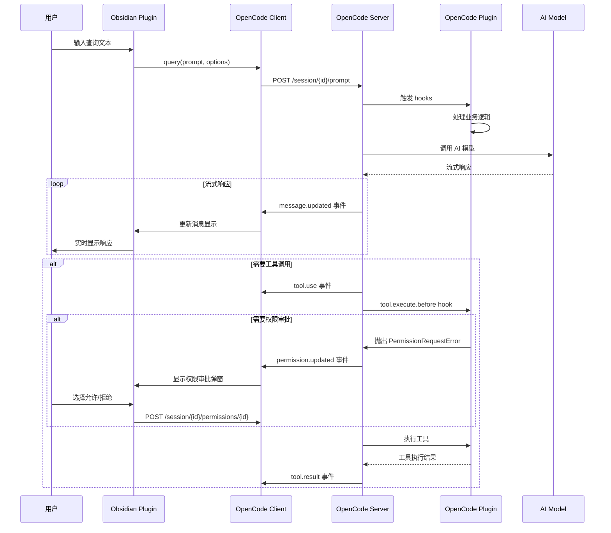
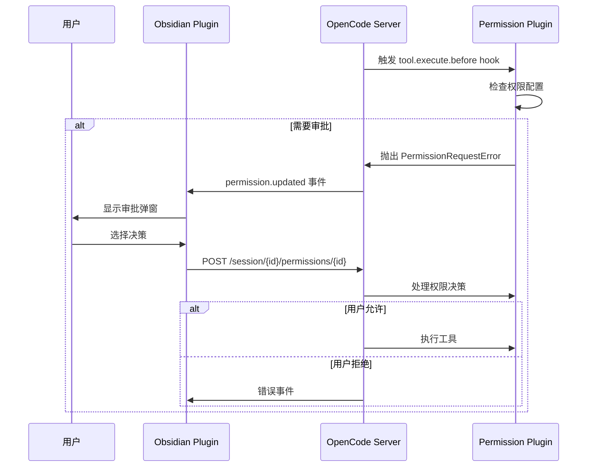
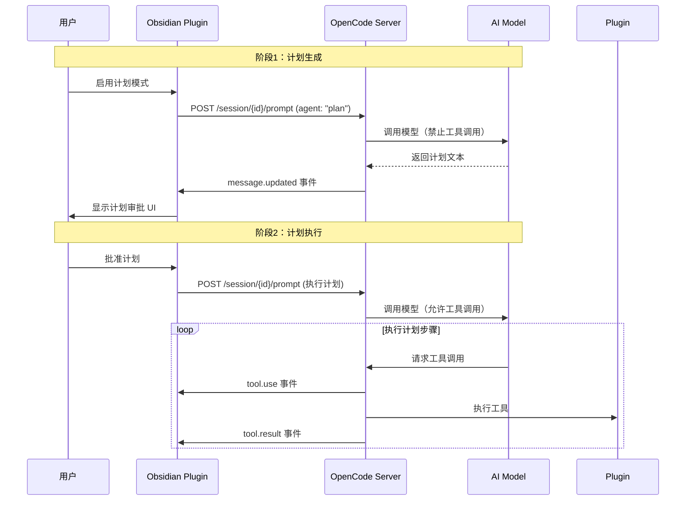

# Claudesidian OpenCode 架构设计文档

> **基于 OpenCode SDK 的 Obsidian 插件重构设计方案**

---

## 目录

1. [概述](#概述)
2. [功能映射](#功能映射)
3. [架构设计](#架构设计)
4. [Plugin 设计](#plugin-设计)
5. [数据流与交互](#数据流与交互)
6. [配置管理](#配置管理)
7. [迁移方案](#迁移方案)
8. [API 参考](#api-参考)

---

## 概述

### 项目背景

Claudesidian 是一个 Obsidian 插件，提供了在 Obsidian 中集成 Claude AI 的能力。当前实现中，Obsidian 插件包含了大量业务逻辑，包括会话管理、权限管理、工具调用等。

随着 OpenCode 的成熟，我们计划将业务逻辑迁移到 OpenCode 插件层，使 Obsidian 插件专注于 UI 渲染和用户交互。

### 设计目标

1. **职责分离**：Obsidian 插件仅负责 UI，业务逻辑下沉到 OpenCode 插件
2. **可维护性**：模块化设计，每个功能点独立实现
3. **可扩展性**：通过 OpenCode 插件系统轻松添加新功能
4. **向后兼容**：保持现有 Obsidian 插件的 UI 和用户体验
5. **性能优化**：利用 OpenCode 的流式处理能力

### 架构原则

- **薄层原则**：Obsidian 插件作为薄客户端层
- **插件化**：所有业务逻辑通过 OpenCode 插件实现
- **事件驱动**：使用 OpenCode 事件系统处理交互
- **配置驱动**：通过 `opencode.jsonc` 管理配置

---

## 功能映射

### 核心服务迁移对照表

| 现有功能 | 当前实现 | OpenCode 迁移方案 |
|---------|---------|------------------|
| **AI 查询** | `ClaudianService.query()` | `client.session.prompt()` |
| **流式响应** | `ClaudianService.queryViaSDK()` | OpenCode Event Stream |
| **会话管理** | `SessionManager` | OpenCode Session API |
| **工具调用** | `tool_use` 事件处理 | OpenCode Tool Events |
| **权限管理** | `ApprovalManager` | OpenCode Permission Plugin |
| **图像处理** | `buildPromptWithImages()` | OpenCode Image Parts API |
| **计划模式** | `planMode` 相关逻辑 | OpenCode Agent API (`agent: "plan"`) |
| **MCP 配置** | `McpService.loadServers()` | `opencode.jsonc` 中的 `mcp` 对象 |
| **斜杠命令** | `SlashCommandManager` | OpenCode Plugin (slash-commands.ts) |
| **文件操作** | `FileContextManager` | OpenCode Plugin (vault-context.ts) |

### UI 组件保留策略

| 组件 | 保留方案 |
|------|---------|
| `ClaudianView` | 完全保留，移除业务逻辑 |
| `MessageRenderer` | 完全保留，数据源改为事件流 |
| `PermissionModal` | 保留 UI，逻辑下沉到 Plugin |
| `FileContextManager` | UI 保留，扫描逻辑下沉到 Plugin |
| `ImageContextManager` | UI 保留，编码逻辑下沉到 Plugin |

---

## 架构设计

### 整体架构

```
┌─────────────────────────────────────────────────────────────┐
│                    Obsidian Plugin Layer                    │
│  (UI Only - Thin Client)                                     │
│                                                              │
│  ┌──────────────┐  ┌──────────────┐  ┌──────────────┐     │
│  │ ClaudianView │  │ Input UI     │  │ Approval UI  │     │
│  │ Renderer     │  │ Components   │  │ Modals       │     │
│  └──────┬───────┘  └──────┬───────┘  └──────┬───────┘     │
│         │                  │                  │              │
│  ┌──────┴──────────────────┴──────────────────┴───────┐     │
│  │         OpenCode Client (Communication)            │     │
│  └──────────────┬─────────────────────────────────────┘     │
└─────────────────┼──────────────────────────────────────────┘
                  │
                  │ HTTP/WebSocket + Event Stream
                  │
┌─────────────────┴──────────────────────────────────────────┐
│                  OpenCode Server Layer                     │
│  (Core Intelligence)                                        │
│                                                              │
│  ┌──────────────┐  ┌──────────────┐  ┌──────────────┐     │
│  │ Session API  │  │ Model API    │  │ Event Stream │     │
│  │ Tool API     │  │ Agent API    │  │ Permission   │     │
│  └──────┬───────┘  └──────┬───────┘  └──────┬───────┘     │
│         │                  │                  │              │
└─────────┼──────────────────┼──────────────────┼──────────────┘
          │                  │                  │
          │ Plugin Hooks     │ Tool Execution   │ Event Handling
          │                  │                  │
┌─────────┴──────────────────┴──────────────────┴──────────────┐
│              OpenCode Plugin Layer                          │
│  (Business Logic - Modular)                                 │
│                                                              │
│  ┌──────────────┐  ┌──────────────┐  ┌──────────────┐     │
│  │ Vault Plugin │  │ Permission   │  │ Plan Mode    │     │
│  │              │  │ Plugin       │  │ Plugin       │     │
│  └──────────────┘  └──────────────┘  └──────────────┘     │
│                                                              │
│  ┌──────────────┐  ┌──────────────┐  ┌──────────────┐     │
│  │ Context      │  │ Slash Command│  │ MCP Router   │     │
│  │ Plugin       │  │ Plugin       │  │ Plugin       │     │
│  └──────────────┘  └──────────────┘  └──────────────┘     │
│                                                              │
│  ┌──────────────┐  ┌──────────────┐                        │
│  │ Session      │  │ Image        │                        │
│  │ Manager      │  │ Processor    │                        │
│  │ Plugin       │  │ Plugin       │                        │
│  └──────────────┘  └──────────────┘                        │
└──────────────────────────────────────────────────────────────┘
```

### 职责划分

| 层级 | 职责 | 技术栈 | 代码量估算 |
|------|------|--------|-----------|
| **Obsidian Plugin** | UI 渲染、用户交互、本地存储 | TypeScript, Obsidian API | ~3000 行 |
| **OpenCode Client** | HTTP 通信、事件流处理、状态同步 | TypeScript, OpenCode SDK | ~500 行 |
| **OpenCode Server** | 会话管理、模型调用、工具编排 | OpenCode Core | 已实现 |
| **OpenCode Plugins** | 业务逻辑、工具扩展、事件处理 | TypeScript, Plugin API | ~2000 行 |

#### 职责边界

**Obsidian Plugin 层职责**：
- ✅ UI 组件渲染（消息列表、输入框、工具栏等）
- ✅ 用户交互处理（点击、键盘输入、拖拽等）
- ✅ 本地状态管理（UI 状态、用户偏好设置）
- ✅ 事件流订阅和显示（接收 OpenCode 事件并渲染）
- ✅ 权限审批 UI（显示审批弹窗，调用权限 API）
- ❌ 业务逻辑处理（权限判断、命令展开、文件操作等）
- ❌ 工具执行逻辑（应由 OpenCode Plugins 处理）

**OpenCode Plugin 层职责**：
- ✅ 业务逻辑处理（权限检查、命令展开、文件操作等）
- ✅ 工具定义和执行（Vault 工具、自定义工具等）
- ✅ 事件处理（session.created、permission.updated 等）
- ✅ Hook 拦截（tool.execute.before、compaction hook 等）
- ✅ 系统 prompt 构建和注入（通过 compaction hook）
- ✅ 配置管理（读取和更新 `opencode.jsonc`）
- ❌ UI 渲染（应由 Obsidian Plugin 处理）
- ❌ 用户交互处理（应由 Obsidian Plugin 处理）

### 通信协议

#### HTTP API

```
POST /session/create
  Body: { agent?: string, model?: ModelConfig }
  Response: { id: string }

POST /session/{id}/prompt
  Body: { system?: string, parts: Part[], model?: ModelConfig, agent?: string }
  Query: { directory?: string }
  Response: { messageId: string }

GET /session/{id}/message/{messageId}
  Response: Message

POST /session/{id}/permissions/{permissionID}
  Body: { response: "allow" | "deny", remember?: boolean }
  Response: 200 OK

GET /event 或 GET /global/event
  Query: { sessionID?: string }
  Response: EventStream (SSE)
```

#### 事件流订阅

Obsidian 插件通过 SSE 订阅事件流，接收以下事件：
- `message.updated` - 消息更新
- `tool.use` - 工具调用
- `tool.result` - 工具执行结果
- `permission.updated` - 权限请求
- `error.occurred` - 错误事件

---

## Plugin 设计

### 4.1 Vault Context Plugin

**文件**：`.opencode/plugin/vault-context.ts`

**功能**：为 Obsidian Vault 提供专门的文件操作工具和上下文管理

**工具定义**：

```typescript
tools: [
  {
    name: "vault_read_file",
    description: "Read a file from the Obsidian vault with Markdown parsing",
    inputSchema: {
      type: "object",
      properties: {
        path: { type: "string", description: "Relative path from vault root" },
        includeLinks: { type: "boolean", default: true },
        includeTags: { type: "boolean", default: true }
      },
      required: ["path"]
    }
  },
  {
    name: "vault_write_file",
    description: "Write a file to the Obsidian vault (auto-creates PARA folders)",
    inputSchema: {
      type: "object",
      properties: {
        path: { type: "string" },
        content: { type: "string" },
        createFolders: { type: "boolean", default: true }
      },
      required: ["path", "content"]
    }
  },
  {
    name: "vault_list_files",
    description: "List files in the vault matching a pattern",
    inputSchema: {
      type: "object",
      properties: {
        pattern: { type: "string", default: "*.md" },
        folder: { type: "string" },
        recursive: { type: "boolean", default: false }
      }
    }
  },
  {
    name: "vault_search_content",
    description: "Search content in vault files",
    inputSchema: {
      type: "object",
      properties: {
        query: { type: "string" },
        scope: { type: "string", enum: ["content", "tags", "links", "all"], default: "all" }
      },
      required: ["query"]
    }
  },
  {
    name: "vault_scan_context_paths",
    description: "Scan specified paths to gather context (replaces ContextPathScanner)",
    inputSchema: {
      type: "object",
      properties: {
        paths: { type: "array", items: { type: "string" } },
        depth: { type: "number", default: 3 },
        includeContent: { type: "boolean", default: false }
      },
      required: ["paths"]
    }
  }
]
```

**要点**：
- 所有工具返回 `StandardToolResult` 结构
- 路径验证包含符号链接解析和 Jail 检查
- `vault_scan_context_paths` 替代原 Obsidian 层的 `ContextPathScanner`

### 4.2 Permission Manager Plugin

**文件**：`.opencode/plugin/permission-manager.ts`

**功能**：权限管理和审批流程

**核心逻辑**：

```typescript
hooks: {
  "tool.execute.before": async ({ tool, input, context }) => {
    // 检查 opencode.jsonc 中的权限配置
    const permission = await getPermissionFromConfig($, directory, tool, input);
    
    if (permission === "allow") {
      return; // 允许执行
    }
    
    if (permission === "deny") {
      throw new Error("Permission denied by configuration");
    }
    
    // permission === "ask" 时，抛出 PermissionRequestError
    // OpenCode Server 会发出 permission.updated 事件
  }
}
```

**权限配置示例**：

```jsonc
{
  "permission": {
    "*": "ask",
    "bash": {
      "*": "deny",
      "git status": "allow",
      "git add *": "ask"
    },
    "vault_read_file": "allow",
    "vault_write_file": "ask"
  }
}
```

**要点**：
- 使用 `tool.execute.before` hook 拦截工具调用
- 抛出错误会阻止工具执行，触发权限请求流程
- Obsidian 插件通过 `POST /session/{id}/permissions/{permissionID}` 应答

### 4.3 Plan Mode Plugin

**文件**：`.opencode/plugin/plan-mode.ts`

**功能**：支持计划模式（Plan Mode），通过两阶段协议实现

**实现方式**：

**阶段1：计划生成**
- 使用 `agent: "plan"` 或 system prompt 禁止工具调用
- Model 生成纯文本计划

**阶段2：计划执行**
- 用户批准后，发送执行请求
- 允许工具调用，每个工具调用通过权限系统审批

**Compaction Hook 支持**：

```typescript
hooks: {
  "experimental.session.compacting": async ({ context, session }) => {
    const planState = await getPlanState(session.id);
    if (planState && planState.approved) {
      return {
        context: [
          ...context,
          { type: "text", text: `Plan Progress: ${planState.summary}` }
        ]
      };
    }
    return { context };
  }
}
```

### 4.4 Slash Commands Plugin

**文件**：`.opencode/plugin/slash-commands.ts`

**功能**：处理斜杠命令的展开和执行

**命令格式**：

```markdown
---
agent: bootstrap
description: Initialize project
---
# Command content

{{args}} - 参数占位符
{{vaultPath}} - Vault 路径
{{currentFile}} - 当前文件
```

**处理策略**：
- 在 Obsidian 插件端检测斜杠命令
- 加载命令文件并展开占位符
- 通过 `client.session.prompt()` 发送，指定 `agent`（如果命令定义了）

### 4.5 MCP Router Plugin

**文件**：`.opencode/plugin/mcp-router.ts`

**功能**：路由工具调用到特定的 MCP 服务器，支持 @-mention 语法

**@-mention 支持**：

```typescript
// 检查是否是 @mention 语法
if (input.startsWith("@")) {
  const [, serverName, actualInput] = input.match(/^@(\w+)\s+(.+)$/);
  // 路由到指定的 MCP 服务器
}
```

**沙箱配置**：

MCP 服务器可在 `opencode.jsonc` 中配置沙箱限制：
- 资源限制（内存、CPU、执行时间）
- 文件系统访问（Jail、只读、白名单/黑名单）
- 网络访问（允许/拒绝主机和端口）

### 4.6 Session Manager Plugin

**文件**：`.opencode/plugin/session-manager.ts`

**功能**：管理 Obsidian Vault 相关的会话上下文

**Vault 检测**：
- 检测目录是否为 Obsidian Vault（检查 `.obsidian` 目录）

**Vault 信息提取**：
- 扫描 PARA 文件夹结构
- 读取插件设置
- 构建 Vault 系统提示

**Compaction Hook**：

```typescript
hooks: {
  "experimental.session.compacting": async ({ context, session }) => {
    const isVault = await checkIfVault($, directory);
    if (isVault) {
      const vaultInfo = await getVaultInfo($, directory);
      const vaultSystemPrompt = buildVaultSystemPrompt(vaultInfo);
      return {
        context: [
          ...context,
          { type: "text", text: vaultSystemPrompt }
        ]
      };
    }
    return { context };
  }
}
```

**性能优化**：
- 内存缓存（5分钟 TTL）
- 增量更新（只更新变更的文件夹）
- 文件系统监听器（实时检测变更）

### 4.7 Image Processor Plugin

**文件**：`.opencode/plugin/image-processor.ts`

**功能**：处理图片相关的操作和优化

**职责迁移**：
- ❌ **之前**：Obsidian 层负责图片 Base64 编码
- ✅ **之后**：Obsidian 仅发送图片文件路径，Plugin 层负责读取和编码

**工具定义**：

```typescript
tools: [
  {
    name: "image_analyze",
    description: "Analyze an image and extract metadata",
    inputSchema: {
      type: "object",
      properties: {
        imagePath: { type: "string" },
        analysisTypes: {
          type: "array",
          items: { type: "string", enum: ["ocr", "objects", "text"] }
        }
      },
      required: ["imagePath"]
    }
  }
]
```

### 4.8 Stream Plugin

**文件**：`.opencode/plugin/stream-plugin.ts`（可选）

**功能**：优化流式响应处理和事件分发

**要点**：
- 实现事件缓冲区管理
- 支持背压控制（高/低水位线）
- 优先级事件处理

---

## 数据流与交互

### 用户查询流程



### 权限审批流程



### 计划模式流程



---

## 配置管理

### opencode.jsonc 配置

```jsonc
{
  "$schema": "https://opencode.ai/config.json",
  
  // 全局权限配置
  "permission": {
    "*": "ask",
    "bash": {
      "*": "deny",
      "git status": "allow",
      "git add *": "ask"
    },
    "vault_read_file": "allow",
    "vault_write_file": "ask"
  },
  
  // Agent 配置
  "agent": {
    "default": {
      "description": "Default agent for general tasks",
      "permission": {
        "bash": { "*": "ask" }
      }
    },
    "plan": {
      "description": "Plan mode agent",
      "permission": {
        "bash": { "*": "ask" }
      }
    }
  },
  
  // MCP 服务器配置
  "mcp": {
    "gemini-vision": {
      "type": "local",
      "command": ["node", ".claude/mcp-servers/gemini-vision.mjs"],
      "environment": {
        "GEMINI_API_KEY": "{env:GEMINI_API_KEY}"
      },
      "enabled": true,
      "sandbox": {
        "resources": {
          "maxMemoryMB": 256,
          "maxCpuPercent": 30
        },
        "filesystem": {
          "readOnly": true,
          "jailRoot": "${vaultRoot}"
        }
      }
    }
  },
  
  // 插件列表
  "plugin": [
    "vault-context",
    "permission-manager",
    "plan-mode",
    "slash-commands",
    "mcp-router",
    "session-manager",
    "image-processor"
  ]
}
```

### Obsidian 插件配置

```json
// .obsidian/claudian.json
{
  "serverUrl": "http://localhost:4096",
  "model": "haiku",
  "permissionMode": "yolo",
  "thinkingBudget": "off",
  "enableAutoTitleGeneration": true,
  "keyboardNavigation": {
    "scrollUpKey": "w",
    "scrollDownKey": "s",
    "focusInputKey": "i"
  }
}
```

---

## 迁移方案

### 阶段一：核心服务迁移（1-2 周）

**目标**：将核心通信逻辑迁移到 OpenCode Client

**任务**：
1. 重构 `ClaudianService` 为 `OpenCodeClient` 封装器
2. 移除 `SessionManager`，使用 OpenCode Session API
3. 迁移流式响应处理到 OpenCode Event Stream
4. 保留现有 UI 层不变

**风险**：低（UI 层保持不变，用户体验不受影响）

### 阶段二：业务逻辑插件化（2-3 周）

**目标**：将业务逻辑迁移到 OpenCode 插件

**任务**：
1. 创建 Vault Context Plugin
2. 创建 Permission Manager Plugin
3. 创建 Plan Mode Plugin
4. 创建 Slash Commands Plugin
5. 创建 MCP Router Plugin
6. 创建 Session Manager Plugin

**风险**：中（需要确保插件与 Obsidian 插件的兼容性）

### 阶段三：UI 层简化（1-2 周）

**目标**：简化 Obsidian 插件，移除冗余代码

**任务**：
1. 简化 `ClaudianView`，移除业务逻辑
2. 简化控制器，仅保留 UI 相关逻辑
3. 更新消息渲染器以适配新的事件格式
4. 移除已迁移的功能代码

**风险**：低（功能已在阶段二验证）

### 阶段四：优化和测试（1-2 周）

**目标**：性能优化和全面测试

**任务**：
1. 性能优化（减少不必要的网络请求）
2. 端到端测试
3. 用户体验优化
4. 文档更新

**风险**：低

### 向后兼容性

**策略**：
- 保持 Obsidian 插件 UI 不变
- 保持现有配置格式（`.obsidian/claudian.json`）
- 逐步迁移功能，支持混合模式
- 提供迁移工具和文档

---

## API 参考

### 关键接口定义

#### StandardToolResult

所有工具应返回统一的标准返回值结构：

```typescript
interface StandardToolResult {
  success: boolean;
  data?: any;
  error?: {
    code: string;
    message: string;
    details?: any;
  };
  metadata?: {
    duration?: number;
    warnings?: string[];
    timestamp?: number;
  };
}
```

#### 事件类型

**message.updated**
```typescript
{
  type: "message.updated",
  properties: {
    sessionId: string;
    messageId: string;
    info: Message;
  }
}
```

**tool.use**
```typescript
{
  type: "tool.use",
  properties: {
    sessionId: string;
    tool: string;
    input: any;
    toolCallId: string;
  }
}
```

**tool.result**
```typescript
{
  type: "tool.result",
  properties: {
    sessionId: string;
    toolCallId: string;
    result: StandardToolResult;
  }
}
```

**permission.updated**
```typescript
{
  type: "permission.updated",
  properties: {
    sessionId: string;
    permissionID: string;
    tool: string;
    input: any;
    requiresApproval: boolean;
  }
}
```

### Hook 类型

**tool.execute.before**
```typescript
hooks: {
  "tool.execute.before": async ({ tool, input, context }) => {
    // 返回 undefined 表示允许执行
    // 抛出错误表示拒绝执行，触发权限请求
  }
}
```

**experimental.session.compacting**
```typescript
hooks: {
  "experimental.session.compacting": async ({ context, session }) => {
    return {
      context: [...context, { type: "text", text: "..." }]
    };
  }
}
```

---

## 总结

本文档概述了将 Claudesidian 从单一 Obsidian 插件架构迁移到 OpenCode 插件架构的设计方案。核心原则是：

1. **职责分离**：Obsidian 插件专注 UI，业务逻辑下沉到 OpenCode 插件
2. **渐进式迁移**：分阶段实施，保持向后兼容
3. **模块化设计**：8 个独立 Plugin，每个负责特定功能域
4. **事件驱动**：通过 OpenCode 事件系统实现松耦合通信

迁移完成后，代码结构更清晰，可维护性和可扩展性显著提升。
